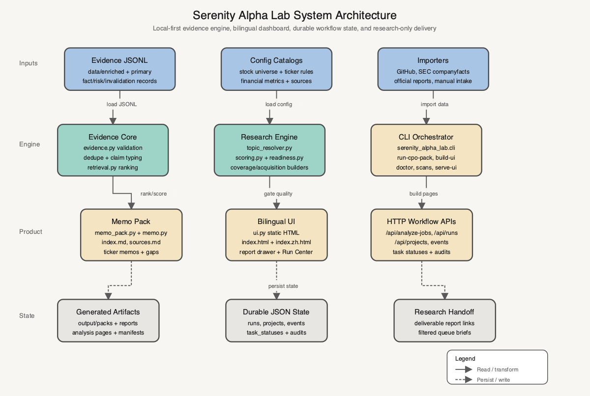
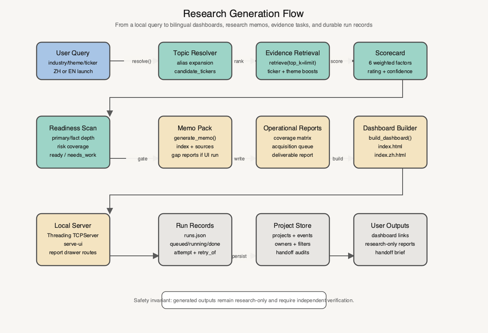
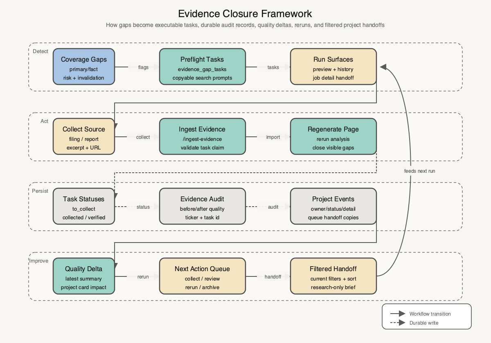

<p align="center">
  <strong>Serenity Alpha Lab</strong><br />
  <sub>Local evidence. Bilingual research. Durable workflow.</sub>
</p>

<h1 align="center">Serenity Alpha Lab</h1>

<p align="center">
  <strong>Turn messy market questions into auditable research workflows.</strong><br />
  A local-first Serenity-style investment research lab for stock, industry, sector, and theme analysis.
</p>

<p align="center">
  <a href="pyproject.toml"></a>
  <a href="Makefile"></a>
  <a href="INSTALL.md"></a>
  <a href="docs/RELEASE_CHECKLIST.md"></a>
</p>

<p align="center">
  <code>evidence -> scorecard -> dashboard -> evidence tasks -> rerun -> handoff</code>
</p>

<p align="center">
  <a href="README.zh.md">中文 README</a>
</p>

> Serenity Alpha Lab is a local research system, not an investment adviser. It does not generate buy/sell/hold instructions, target prices, or position sizing. Every output is a research artifact that must be independently verified before any capital decision.

## Recent highlights

**Filtered project handoffs** — saved-project users can now copy exactly the current filtered and sorted project queue, preview the handoff before sharing it, and record the action in the project review event log.

**Collaboration-ready project library** — project cards and detail drawers expose owner assignment, activity filters, latest activity summaries, event-type filters, next-action queues, evidence progress, latest evidence impact, and durable audit trails.

**Background analysis runs** — analysis launches can submit through `/api/analyze-jobs`, return immediately with durable run metadata, and keep the Run Center polling queued, running, completed, failed, cancelled, and retry states.

**Evidence closure loop** — preflight evidence gaps become executable tasks with copyable search prompts, report-section import handoff links, task-status persistence, quality delta summaries, and rerun context.

## Architecture visuals

The diagrams below use the `fireworks-tech-graph` Claude Official style 6: warm cream backgrounds, rounded high-contrast nodes, soft blue source nodes, teal processing nodes, beige infrastructure nodes, and gray durable-state nodes.

### System architecture

<p align="center">
  
</p>

The system is intentionally local-first. JSONL evidence, curated config catalogs, and importer outputs feed the Python research engine. The CLI orchestrates package generation and UI publication, while the dashboard server exposes local workflow APIs for runs, projects, events, task statuses, and evidence audits.

### Research generation flow

<p align="center">
  
</p>

A query is resolved into a canonical theme and candidate tickers, ranked against local evidence, scored through the Serenity scorecard, gated by readiness checks, and published as bilingual dashboards, memo packs, operational reports, and durable run records.

### Evidence closure framework

<p align="center">
  
</p>

Evidence gaps become concrete tasks, import handoffs, task status records, audit entries, quality delta summaries, rerun context, next-action queues, and filtered research-only handoff briefs.

SVG sources are kept beside the PNG assets:

- [`serenity-system-architecture.svg`](docs/assets/diagrams/serenity-system-architecture.svg)
- [`serenity-research-flow.svg`](docs/assets/diagrams/serenity-research-flow.svg)
- [`serenity-evidence-closure-framework.svg`](docs/assets/diagrams/serenity-evidence-closure-framework.svg)

## What is Serenity Alpha Lab?

Serenity Alpha Lab is a local-first research engine for turning an industry, sector, theme, or ticker question into a traceable investment-research workspace.

It combines:

- evidence-backed claim storage
- claim-type classification for fact, methodology, inference, risk, catalyst, and invalidation evidence
- deterministic retrieval and transparent Serenity-style scoring
- skeptic review and invalidation checks
- source-backed local financial context when evidence exists
- bilingual Chinese and English dashboard and report generation
- a saved-project library with workflow state, audit history, and handoff artifacts
- markdown memo generation and drawer-based report reading

The default CPO pack evaluates `AAOI`, `LITE`, `COHR`, `AXTI`, `SIVE`, and `NVDA` using local evidence, SEC companyfacts snapshots, official report excerpts, and guarded manual intake evidence.

```text
input query
  -> topic resolver
  -> evidence-backed candidates
  -> Serenity scorecard
  -> bilingual dashboard
  -> evidence acquisition queue
  -> project library / handoff
```

## Install

Use Python 3.9 or newer from a fresh local checkout:

```bash
python3 -m pip install -e .
make smoke
make verify
```

Source-tree fallback:

```bash
PYTHONPATH=src python3 -m serenity_alpha_lab.cli doctor
PYTHONPATH=src python3 -m serenity_alpha_lab.cli run-cpo-pack --allow-skipped
PYTHONPATH=src python3 -m serenity_alpha_lab.cli build-ui --language both
```

See [`INSTALL.md`](INSTALL.md) for a clean-machine validation path.

## Quick start

Build the default product outputs:

```bash
PYTHONPATH=src python3 -m serenity_alpha_lab.cli doctor
PYTHONPATH=src python3 -m serenity_alpha_lab.cli run-cpo-pack --allow-skipped
PYTHONPATH=src python3 -m serenity_alpha_lab.cli build-financial-metrics \
  --data data/enriched/github_plus_primary.jsonl data/primary/sive_official_report_evidence.jsonl \
  --out config/financial_metrics.json
PYTHONPATH=src python3 -m serenity_alpha_lab.cli build-ui --language both
```

Start the local product server:

```bash
PYTHONPATH=src python3 -m serenity_alpha_lab.cli serve-ui \
  --host 127.0.0.1 \
  --port 8767 \
  --language both
```

Open:

- Chinese UI: `http://127.0.0.1:8767/index.zh.html`
- English UI: `http://127.0.0.1:8767/index.html`

Use `Start analysis` / `启动分析` for a new local industry, sector, theme, or ticker report such as `存储芯片`, `HBM`, `半导体设备`, or `AAOI`. The page search box filters the currently open dashboard; it does not launch new analysis.

## Stable product run

The release gate is:

```bash
make verify
```

It runs:

- `python3 -m pytest tests -q`
- `PYTHONPATH=src python3 -m serenity_alpha_lab.cli doctor`
- `PYTHONPATH=src python3 -m serenity_alpha_lab.cli run-cpo-pack`
- `PYTHONPATH=src python3 -m serenity_alpha_lab.cli build-coverage-matrix ...`

For the full user-facing surface, also regenerate metrics and bilingual UI:

```bash
PYTHONPATH=src python3 -m serenity_alpha_lab.cli build-financial-metrics \
  --data data/enriched/github_plus_primary.jsonl data/primary/sive_official_report_evidence.jsonl \
  --out config/financial_metrics.json

PYTHONPATH=src python3 -m serenity_alpha_lab.cli build-ui --language both
```

Scan generated reports for product-authored investment advice before handoff:

```bash
PYTHONPATH=src python3 -m serenity_alpha_lab.cli scan-report-safety \
  --reports output/packs/cpo-guarded/*-memo.md \
  --out output/reports/report-safety-scan.md
```

The scanner distinguishes product prose from quoted source excerpts, so external evidence can contain investment-action language without being confused with Serenity Alpha Lab guidance.

## Product surface

| Surface | What it does |
| --- | --- |
| Bilingual dashboard | Renders English and Chinese research pages with candidate comparison, source coverage, risk previews, and report drawers. |
| Run Center | Persists analysis lifecycle state across queued, running, completed, failed, cancelled, and retry records. |
| Project library | Saves generated analyses as reusable project records with quality snapshots, next actions, owners, and status filters. |
| Evidence tasks | Turns missing primary, risk, demand, invalidation, and crowding evidence into executable collection tasks. |
| Audit logs | Records project events, evidence verification, quality delta summaries, owner changes, and queue handoff copies. |
| Handoff package | Copies research-only project queues, deliverable links, manifests, coverage matrices, and evidence queues for another reviewer. |

## Workflow surface

Serenity Alpha Lab keeps the user workflow explicit:

| Step | User action | Durable output |
| --- | --- | --- |
| Resolve | Enter an industry, theme, sector, or ticker. | Canonical theme, candidate tickers, and coverage metadata. |
| Generate | Launch analysis through the local UI or CLI. | Bilingual dashboard, memo pack, run record, and analysis manifest. |
| Compare | Review the candidate comparison table first. | Score, rating, confidence, key gaps, evidence coverage, and financial context. |
| Investigate | Open the report drawer and operational reports. | Deliverable research report, coverage matrix, and evidence acquisition queue. |
| Close gaps | Collect evidence, import it, and mark tasks verified. | Task statuses, audit entries, quality-before/after context, and rerun links. |
| Handoff | Filter project queues and copy research-only handoff briefs. | Review-event trace and shareable workflow context. |

## Generated outputs

The product pipeline regenerates:

- `data/enriched/github_plus_primary.jsonl`
- `output/reports/cpo-readiness-guarded.md`
- `output/packs/cpo-guarded/index.md`
- `output/packs/cpo-guarded/sources.md`
- one memo per ready ticker in `output/packs/cpo-guarded/`
- `config/financial_metrics.json`
- `output/reports/universe-coverage-matrix.md`
- `output/ui/index.html`
- `output/ui/index.zh.html`
- generated analysis pages under `output/ui/analyses/<slug>/`

Each UI-launched analysis writes query-specific operational reports under `output/ui/analyses/<slug>/reports/`:

- `universe-coverage-matrix.md`
- `evidence-acquisition-queue.md`
- `deliverable-research-report.md`

When analysis starts from the Chinese UI, the operational report bodies are localized in Chinese, not just the buttons.

## User workflow

For Chinese users:

1. Start the server and open `http://127.0.0.1:8767/index.zh.html`.
2. In `启动分析`, enter an industry, sector, theme, or ticker, for example `存储芯片` or `HBM`.
3. Wait for the generated analysis page under `output/ui/analyses/<slug>/`.
4. Read `候选对比` first to compare tickers by Serenity score, rating, confidence, key gaps, evidence coverage, and financial context.
5. Use `查看报告` to open the right-side report drawer.
6. Review `证据补齐行动清单` before trusting or promoting a candidate.
7. Open `覆盖矩阵` and `证据采集队列` from the generated analysis page.
8. Use `最近报告` and the saved-project library to reopen, filter, compare, and hand off analyses.

English users follow the same flow from `http://127.0.0.1:8767/index.html`.

## Import Serenity GitHub projects

The GitHub importer reads a curated repo manifest, fetches public markdown files, extracts Serenity-style supply-chain claims, and writes them as auditable evidence JSONL:

```bash
PYTHONPATH=src python3 -m serenity_alpha_lab.cli import-github \
  --repos imports/github_repos.json \
  --out data/imported/github_evidence.jsonl
```

Then generate a memo from curated seed evidence and imported GitHub evidence:

```bash
PYTHONPATH=src python3 -m serenity_alpha_lab.cli \
  --data data/seed/evidence.jsonl data/imported/github_evidence.jsonl \
  --query "CPO laser bottleneck" \
  --ticker SIVE \
  --out output/memos/sive-cpo-enriched.md
```

Imported evidence remains third-party research context. Treat it as derived or speculative until independently confirmed by primary filings, transcripts, customer disclosures, or direct archived posts.

## Report anatomy

Generated memos include:

- research question
- scorecard
- Serenity rating, confidence tier, and key evidence gaps
- industry structure map by supply-chain layer
- catalyst timeline from dated fact and catalyst evidence
- evidence gap priority table with next evidence actions
- claim-type mix
- thesis summary
- supporting evidence
- skeptic review
- invalidation conditions
- evidence action plan
- next research tasks
- research-only disclaimer

Chinese generated reports also include `投资分析结论`, `Serenity 选股因子`, `关键跟踪指标`, and `证据补齐行动清单`.

## Development

Run focused checks while editing:

```bash
python3 -m pytest tests -q
python3 -m pytest tests/test_ui_http_e2e.py -q
```

Run the HTTP-level UI smoke after changing dashboard, launcher, report drawer, or local server behavior:

```bash
PYTHONPATH=src python3 -m pytest tests/test_ui_http_e2e.py -q
```

The smoke starts a local ephemeral HTTP server, opens the Chinese homepage, calls `/analyze?query=存储芯片&language=zh`, follows the generated analysis page, and verifies the Chinese memo file used by the report drawer.

Useful release and handoff docs:

- [`INSTALL.md`](INSTALL.md)
- [`CHANGELOG.md`](CHANGELOG.md)
- [`docs/RELEASE_CHECKLIST.md`](docs/RELEASE_CHECKLIST.md)

## Configuration notes

Optional CPO pack output overrides:

```bash
PYTHONPATH=src python3 -m serenity_alpha_lab.cli run-cpo-pack \
  --combined-out data/enriched/github_plus_primary.jsonl \
  --readiness-out output/reports/cpo-readiness-guarded.md \
  --pack-out-dir output/packs/cpo-guarded
```

Optional dashboard output overrides:

```bash
PYTHONPATH=src python3 -m serenity_alpha_lab.cli build-ui \
  --readiness output/reports/cpo-readiness-guarded.md \
  --pack-dir output/packs/cpo-guarded \
  --out output/ui/index.html \
  --language both
```

Optional financial metrics output override:

```bash
PYTHONPATH=src python3 -m serenity_alpha_lab.cli build-financial-metrics \
  --data data/enriched/github_plus_primary.jsonl data/primary/sive_official_report_evidence.jsonl \
  --out config/financial_metrics.json
```

## Inspirations and lineage

Serenity Alpha Lab borrows the visible README rhythm of focused tool projects: centered identity, concise promise, current highlights, workflow tables, and explicit verification gates. The product itself stays anchored in local evidence, bilingual research workflows, and transparent research-only boundaries.

## License

See the repository license before distribution. If no license file is present in this checkout, treat the code as not licensed for redistribution until one is added.
