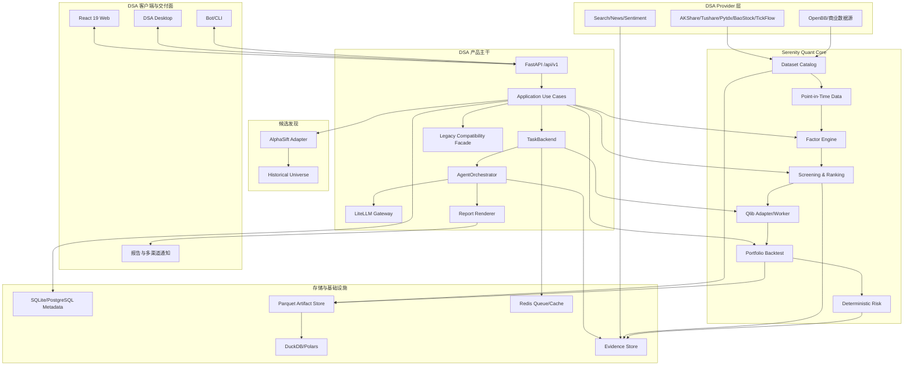
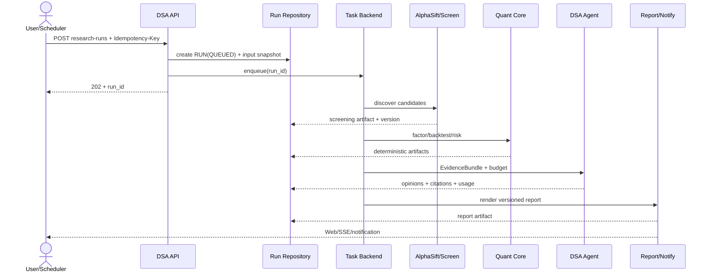
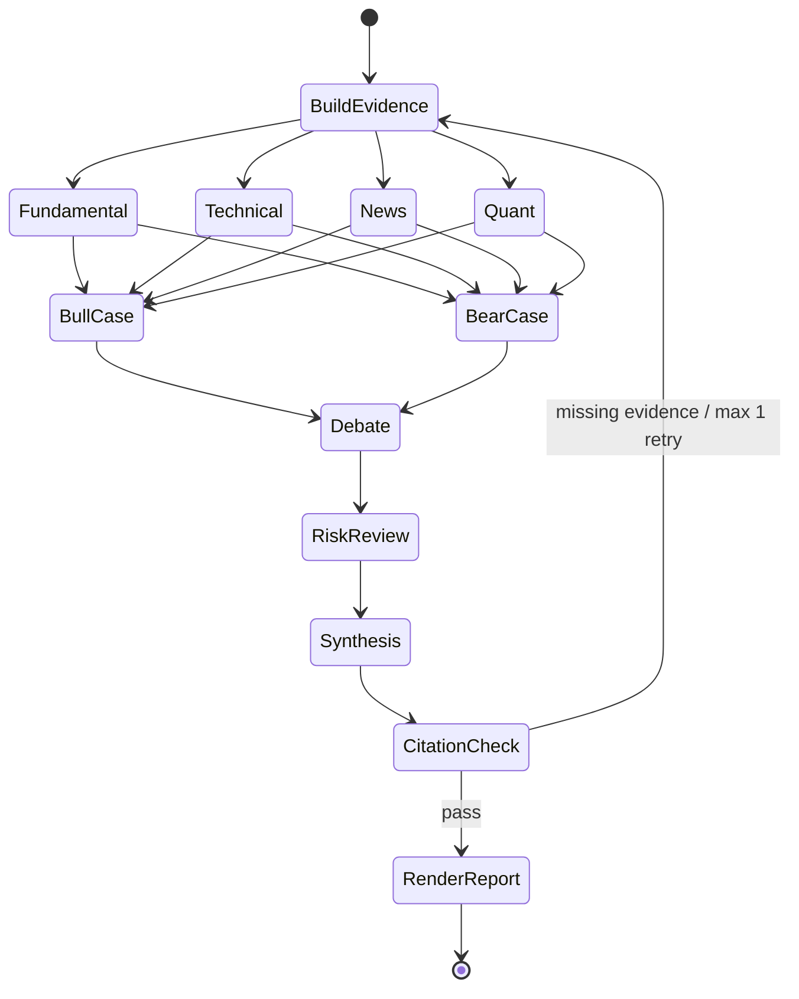

# Serenity Alpha Lab：基于 daily_stock_analysis 的 AI 股票研究与量化平台开发方案

> 文档版本：v2.0<br>
> 编制日期：2026-07-18<br>
> 项目阶段：绿地项目，拟以 daily_stock_analysis 为上游产品主干<br>
> 建议上游基线：`ZhuLinsen/daily_stock_analysis v3.26.1`；正式导入前以候选 commit 完成全量回归后锁定<br>
> 首期市场：A 股，复用上游港股、美股、日股、韩股、台股查询能力，但不承诺同等级量化能力<br>
> 首期用途：研究、筛选、回测、模拟组合与研究报告，不包含实盘自动下单<br>
> 当前状态：[开发状态快照](./development-status.md)<br>
> 执行跟踪：[开发进度跟踪清单](./development-progress-checklist.md)

## 1. 执行摘要

Serenity Alpha Lab 采用“**daily_stock_analysis 产品主干 + AlphaSift 候选发现 + 自建 Quant Core**”的路线。这里的“主干”特指可运行产品、AI 分析、数据源降级、报告、通知、API、Web/桌面工作台和现有测试资产；量化研究所要求的时点数据、数据版本、因子评价、组合回测和硬风控作为独立核心补齐，不能由上游现有同名功能替代。

目标闭环：

```text
AlphaSift/自定义股票池发现候选
  -> DSA Provider 获取行情、基本面、新闻与市场上下文
  -> Quant Core 完成时点校验、因子加工、筛选和组合回测
  -> DSA Agent Orchestrator 对最终候选执行证据化深度研究
  -> 硬风控裁决
  -> DSA Web/桌面端/报告/通知交付
```

本方案做出以下不可互相替代的架构决策：

1. **以 DSA 作为产品主干**：保留其 FastAPI、React 19、桌面端、LiteLLM、多数据源、Agent、报告、通知、持仓和大量回归测试，不做无收益的框架重写。
2. **不把 DSA 当作量化内核**：现有 `BacktestEngine` 主要是历史决策信号结果评价，应重命名为 `SignalEvaluationEngine`；完整组合回测由新的 `QuantEngine` 提供。
3. **AlphaSift 是筛选插件**：负责全市场候选发现、快照硬筛和初步排序；它公开声明不是完整历史数据库或严谨事件回测系统，因此不能承担数据湖和组合回测职责。
4. **确定性计算与 AI 分离**：价格、财务指标、因子、评分、成交、组合净值和风险指标由可复现代码计算；LLM 只做证据归纳、观点对抗和叙事。
5. **渐进式模块化**：先在 DSA 单仓中建立协议、Repository、Run/Artifact 和 Adapter 边界，再将高资源 Quant Worker 独立部署；不在第一阶段拆成大量微服务。
6. **双运行模式**：保留 SQLite + 本地文件的个人桌面模式；团队/服务模式使用 PostgreSQL、Redis、Parquet 和持久化 Worker。
7. **兼容优先而非技术栈统一**：上游 Pandas 数据链继续工作，Quant Core 内部可使用 Polars/DuckDB；二者只在版本化 Schema/Artifact 边界交换数据。
8. **上游可持续同步**：保留 DSA 上游 Git 历史和独立 `upstream` remote，维护最小补丁集；所有侵入式修改先通过接口包裹。
9. **许可证先于代码融合**：DSA 为 MIT、AlphaSift 为 Apache-2.0；OpenBB AGPL、TickFlow 服务条款、模型权重和数据再分发分别治理。
10. **A 股量化优先、实盘延后**：MVP 聚焦日频筛选、可信回测和模拟组合，禁止 Agent 直接下单。

DSA 已提供约 510 个 Python 文件、226 个后端测试文件、React Web、桌面端和 10 条 GitHub Workflow，能够显著降低产品层成本。但其仓库增长快、依赖锁定不足、内存任务队列和集中式 `storage.py` 不适合直接扩展成团队量化平台，必须先实施本文的 P0 工程加固。

依据原子任务清单，128 个可估算任务约 268.5 理想人日，另有 10 个交易日稳定观察。建议 4 人团队按 16~18 周交付可内部使用的融合 MVP；5 人团队可争取 13~15 周；2 人团队应按 30~36 周估算。多市场量化一致性、复杂 Agent 辩论和实时数据仍排到 MVP 之后。

## 2. 需求理解与产品边界

### 2.1 用户需求的本质

“AI 驱动股票筛选、分析、量化”实际上包含三种性质不同的系统：

- **数据与量化系统**：强调时点正确、可复现、低延迟批计算和避免回测偏差。
- **投资研究系统**：强调多源证据、可追溯引用、观点冲突与结论解释。
- **工作台产品**：强调筛选效率、任务状态、结果对比、可视化和报告交付。

三者不能由一个“万能 Agent”替代。正确的融合方式是让量化系统产出事实和候选集，让 Agent 在受控证据范围内分析，再由风险规则和用户完成最终裁决。

### 2.2 目标用户

- 有 Python/量化基础、希望快速验证选股思想的个人研究者。
- 需要结构化股票池、回测和研究报告的小型投研团队。
- 需要把内部数据源、模型和 LLM 接入统一工作台的开发团队。

### 2.3 MVP 核心场景

1. 配置股票池、ST/停牌/上市天数/流动性等过滤规则。
2. 使用技术、基本面、质量、估值、成长、动量等因子进行组合筛选和排序。
3. 保存筛选策略，在指定交易日重放并比较结果。
4. 对筛选结果执行含手续费、滑点、涨跌停和停牌约束的组合回测。
5. 对单股或候选组合生成带证据引用的多视角研究报告。
6. 对回测、因子和 Agent 运行进行版本追踪、成本统计和结果复现。
7. 通过 Web 查看股票池、K 线、因子解释、回测曲线、风险暴露和研究报告。

### 2.4 MVP 明确不做

- 不提供收益承诺、AI 荐股或“涨停预测”。
- 不允许 LLM 直接下单，不接实盘券商账户。
- 不做高频、逐笔或盘口级回测。
- 不在首期训练金融大模型，也不将 RL 作为默认策略引擎。
- 不追求覆盖所有证券市场和所有数据源。
- 不构建 Kubernetes 微服务集群；单机和 Docker Compose 必须可运行。

## 3. 开源项目调研与取舍

### 3.1 调研方法

截至 2026-07-18，通过 GitHub 仓库元数据、目录结构、依赖清单、测试/CI 布局、许可证和公开文档进行复核。Star 仅表示社区关注度，不直接代表代码质量；成熟度判断同时考虑维护活跃度、模块边界、测试、发布方式、依赖健康和许可证。

### 3.2 核心候选对比

| 项目 | 调研时 Star（约） | 许可证 | 可借鉴/接入能力 | 主要风险 | 本项目定位 |
|---|---:|---|---|---|---|
| [ZhuLinsen/daily_stock_analysis](https://github.com/ZhuLinsen/daily_stock_analysis) | 57.7k | MIT | 多市场 Provider、LiteLLM、Agent、报告、通知、FastAPI、React/桌面端、持仓和回归测试 | 创建时间较短且迭代快；依赖未完整锁定；SQLite/内存任务队列；现有回测不是完整组合回测 | **产品与 AI 分析主干** |
| [ZhuLinsen/alphasift](https://github.com/ZhuLinsen/alphasift) | 0.3k | Apache-2.0 | A 股全市场候选发现、策略 YAML、横截面评分、LLM 排名、T+N 评价 | 快照筛选为主；非完整历史库/事件回测；2026-04 才创建 | **候选发现插件，通过 Adapter 接入** |
| [microsoft/qlib](https://github.com/microsoft/qlib) | 46.4k | MIT | 数据集、因子表达式、模型训练、实验记录、组合策略、回测 | 依赖较重；自身数据格式和工作流有学习成本 | **直接依赖，但置于 Quant Adapter/Worker 后** |
| [OpenBB-finance/OpenBB](https://github.com/OpenBB-finance/OpenBB) | 70.7k | AGPL-3.0-only | Provider 扩展体系、全球金融数据统一接口、API/MCP | AGPL 网络使用义务；部分 Provider 需付费或受数据条款约束 | **可选外部服务，不进入默认核心依赖** |
| [akfamily/akshare](https://github.com/akfamily/akshare) | 21.4k | MIT | A 股、基金、宏观等公开数据接口 | 上游页面变化会导致接口漂移；数据质量和 SLA 无保证 | **MVP 默认 A 股 Provider，必须有缓存和契约测试** |
| [TauricResearch/TradingAgents](https://github.com/TauricResearch/TradingAgents) | 93.5k | Apache-2.0 | 分析师、研究员、交易员、风控和组合经理的 Agent 分工；LangGraph 状态流 | LLM 非确定性、成本高；示例偏研究，不宜直接承担生产风控 | **借鉴角色与辩论流程，映射到 DSA Orchestrator** |
| [AI4Finance-Foundation/FinRobot](https://github.com/AI4Finance-Foundation/FinRobot) | 7.6k | Apache-2.0 | 金融报告、多 Agent、工具调用、确定性计算 + LLM 叙事理念 | 依赖存在旧版本和冲突；整体工程化程度不适合作为底座 | **借鉴报告和证据组织，不直接依赖主包** |
| [shy3130/tickflow-stock-panel](https://github.com/shy3130/tickflow-stock-panel) | 2.3k | LICENSE 为 MIT；README 另有非商用声明 | A 股选股/监控/回测工作台、Polars + DuckDB + FastAPI + React 产品形态 | 项目创建时间短；TickFlow 服务条款；许可证表述需法律确认 | **仅作产品与模块参考，不复制代码** |
| [AI4Finance-Foundation/FinRL](https://github.com/AI4Finance-Foundation/FinRL) | 15.8k | MIT | 强化学习交易环境与算法实验 | 极易过拟合；训练、验证和上线治理成本高 | **Phase 3 研究插件** |
| [AI4Finance-Foundation/FinGPT](https://github.com/AI4Finance-Foundation/FinGPT) | 20.9k | MIT | 金融 NLP、情绪分析和模型适配 | 模型权重、数据集各有独立许可；维护成本高 | **可选 NLP Provider，不纳入 MVP** |
| [ranaroussi/quantstats](https://github.com/ranaroussi/quantstats) | 7.5k | Apache-2.0 | 组合绩效指标和 tear sheet | 指标口径需统一，不能与平台口径混用 | **可选报告适配器** |
| [kernc/backtesting.py](https://github.com/kernc/backtesting.py) | 8.7k | AGPL-3.0 | 简洁单资产策略回测 | AGPL；组合和 A 股约束不是其强项 | **不纳入默认依赖** |
| [polakowo/vectorbt](https://github.com/polakowo/vectorbt) | 8.4k | GitHub 未识别统一 SPDX | 向量化参数扫描、快速策略实验 | 社区版/商业版边界与许可证需单独核验 | **仅在许可证确认后作为实验插件** |

### 3.3 融合决策

采用“单一产品主干 + 能力插件 + 接口隔离”。DSA 代码保留完整上游历史，其他仓库不做源码级无边界合并：

| 能力 | 首选实现 | 接入方式 | 退出/替换策略 |
|---|---|---|---|
| 产品/API/Web/桌面端 | DSA | 以正式 release/commit 为基线建立 fork | 维护 upstream remote 和补丁清单 |
| A 股原始数据 | DSA Provider Manager | 通过新的 `MarketDataProvider` 领域适配器收口 | 继续利用 AKShare、Tushare、BaoStock、Pytdx、TickFlow 等降级链 |
| 候选发现 | AlphaSift | 固定版本的包/内部 Wheel + `ScreeningProvider` | 可替换自有筛选器，输出契约保持稳定 |
| 全球数据 | OpenBB 或商业 API | 独立进程/HTTP Provider，可选安装 | 不启用时核心功能正常 |
| 数据存储与分析查询 | Parquet + DuckDB + Polars | 自有数据层 | 可迁移对象存储/ClickHouse |
| 因子研究、模型、回测 | Qlib | 独立 Worker + `QuantEngine` 接口 | 可替换自有引擎或其他回测插件 |
| 绩效报告 | 自有统一口径，QuantStats 可选 | `PerformanceReporter` 适配器 | 保留原始收益序列，可重算 |
| Agent 编排 | DSA `AgentOrchestrator` | 先抽取 `ResearchOrchestrator` 协议并增强持久化 | 出现复杂分支/恢复需求后再评估 LangGraph |
| 模型接入 | DSA LiteLLM 路由 | `LLMProvider` 门面 + 现有 usage/provider trace | 可替换特定模型，不影响 Agent |
| 金融报告与通知 | DSA Renderer/Sender | 增加 Evidence/Artifact 输入契约 | 保留现有多渠道生态 |
| 前端工作台 | DSA React 19 Web + Desktop | 新量化页面通过版本化 API 接入 | 复用现有路由、主题、状态与构建体系 |

### 3.4 主干策略与非主干项目边界

- **只 fork DSA**：因为它与目标产品在运行形态、用户流程和技术栈上高度重合。
- **AlphaSift 使用包/服务接口**：它与 DSA 官方定位本就通过 API/Adapter 解耦；禁止把内部快照字段当作平台领域模型。
- **Qlib 使用 Worker Adapter**：避免其重依赖、数据格式和实验生命周期侵入 Web/API。
- **OpenBB 外部部署**：避免默认发行物被 AGPL 和大量 Provider 依赖绑定。
- **TradingAgents/FinRobot 只吸收模式**：DSA 已有 Agent Orchestrator、报告和模型路由，替换框架的收益低于迁移风险。
- **FinRL/FinGPT 为后期实验**：不进入 MVP 关键路径，不允许实验依赖拖累主应用升级。

### 3.5 DSA 技术审计结论

调研基线为最新 release `v3.26.1`（2026-07-12）；正式实施应对选定 commit 重跑测试并记录 `upstream_commit`。仓库当前约有 510 个 Python 文件、226 个后端测试文件、8 个前端测试/E2E 文件和 10 个 Workflow。

| 领域 | 当前状态 | 处理决策 | P0 验收 |
|---|---|---|---|
| API | FastAPI `/api/v1`，端点覆盖分析、Agent、回测、持仓、告警、配置 | 保留；新量化 API 不破坏现有契约 | 上游 OpenAPI 快照无非预期破坏 |
| Web/桌面 | React 19/Vite 7；桌面端独立应用 | 保留；新增 Screen Lab、Quant Lab 和 Dataset 页面 | 现有构建、Smoke/E2E 通过 |
| 数据源 | 多 Provider + 自动降级，但以 Pandas 和供应商字段为主 | 保留抓取层；增加标准 DTO、原始快照和质量门禁 | 同一证券跨 Provider 的核心字段契约一致 |
| 存储 | SQLAlchemy + SQLite；模型和手工迁移集中在 `src/storage.py` | 建立 Repository/Alembic；桌面 SQLite 与服务 PostgreSQL 双 Profile | 空库升级、历史库迁移和回滚演练通过 |
| 任务 | `AnalysisTaskQueue` + `ThreadPoolExecutor`，状态在进程内 | 增加 `TaskBackend`；本地保留内存实现，服务端用持久化队列 | API 重启后任务状态不丢失 |
| Backtest | 对 AI 建议信号做 T+N 结果评价 | 重命名为 Signal Evaluation；新增独立组合回测 | 两类 API、模型和指标不混用 |
| Agent | 自研 Orchestrator、技能/策略 Agent、模型路由、降级和 usage 记录 | 保留；增加 Evidence、checkpoint、预算和引用验证 | 每个结论能追溯到证据与模型调用 |
| 筛选 | 通过固定 Git commit 安装 AlphaSift | 改为已审查 Wheel/包版本，增加 Adapter 和契约测试 | 无网络构建、SBOM 可追踪、结果可版本化 |
| 依赖 | `requirements.txt` 多为范围版本；`pyproject.toml` 主要是工具配置 | 迁移到标准 project metadata + `uv.lock`，分 core/desktop/quant/dev extras | 干净环境可重复构建 |
| CI | 后端离线测试、Docker build、前端 lint/build；前端仅变更时运行 | 增加类型、迁移、契约、许可证、量化金标和 E2E 门禁 | 合并所需检查可重复、无隐式联网 |

### 3.6 上游代码接管方式

1. 以 DSA 正式 release 创建 `upstream/dsa-v3.26.1` 不可变基线标签。
2. 仓库保留 `origin`（本项目）和 `upstream`（DSA）两个 remote。
3. 主开发分支只接受小步迁移；每个上游修改点记录在 `docs/upstream-patches.md`。
4. 每两周或安全修复出现时建立临时 `sync/dsa-<version>` 分支，先跑兼容矩阵，再合并。
5. 能通过扩展点实现的功能不修改上游核心；必须修改时先补 Characterization Test。
6. 不直接跟踪上游 `main` 部署生产，所有升级固定 tag/commit、锁依赖并生成 SBOM。

## 4. 产品原则与关键质量属性

### 4.1 产品原则

1. **每个结论都能追溯**：页面和报告中的关键判断必须链接到指标、原始证据和数据时间。
2. **每次运行都能复现**：保存数据集版本、代码提交、参数、随机种子、模型与 Prompt 版本。
3. **AI 不是计算器**：LLM 不负责计算收益率、估值、技术指标或组合权重。
4. **默认保守**：缺失数据、时间戳不明、证据冲突时降低置信度，而不是补造结论。
5. **先批处理后实时**：日频闭环稳定后再引入盘中流式数据。
6. **先单体后拆分**：边界先体现在代码和契约中，部署拓扑按负载演进。

### 4.2 非功能目标

| 属性 | MVP 目标 |
|---|---|
| 可用性 | 单机 Docker Compose 月度可用性目标 99.0% |
| API 性能 | 缓存命中查询 P95 < 500ms；普通筛选 P95 < 3s |
| 批处理 | 全 A 股日频数据更新与常用因子计算在交易日收盘后 60 分钟内完成 |
| 可复现性 | 相同代码、数据快照和参数下，确定性任务结果哈希一致 |
| Agent 可审计性 | 100% 报告记录模型、Prompt、工具调用、Token 成本与证据引用 |
| 数据质量 | 核心 OHLCV 完整率 >= 99.5%；异常数据阻断发布而非静默写入 |
| 安全 | 密钥不落库明文、不进入日志、不进入前端 |

## 5. 总体架构



架构中的 `Legacy Compatibility Facade` 是迁移期关键组件：现有 DSA API、数据库模型和调用方继续工作，新实现通过 Facade 替换内部行为。只有在兼容测试覆盖后，才删除旧路径。

### 5.1 运行 Profile

| Profile | 适用场景 | 进程与存储 | 限制 |
|---|---|---|---|
| `desktop` | 单用户、本地体验 | DSA Desktop + API；SQLite；本地 Parquet；进程内任务 | 不支持多实例和高并发；重任务默认串行 |
| `standalone` | 个人服务器/NAS | Web + API + Worker；SQLite/PostgreSQL 二选一；Redis；本地 Parquet | 单节点；需要备份挂载目录 |
| `team` | 小型投研团队 | Web/API 多实例；PostgreSQL；Redis；独立 data/quant/agent Worker；S3/MinIO | 需要 OIDC、权限、审计和监控 |
| `ci` | 离线回归 | SQLite 临时库；本地 fixture；Fake Provider/LLM | 禁止真实联网和真实模型费用 |

MVP 必须同时保证 `desktop` 和 `standalone`，团队 Profile 可在 RC 阶段完善。

### 5.2 进程和队列划分

服务模式使用以下进程：

- `web`：复用 DSA Web 构建物；只通过 API 获取业务数据。
- `api`：复用 DSA FastAPI，负责鉴权、查询、命令提交、SSE 进度和幂等校验，不执行长任务。
- `worker-data`：Provider 拉取、原始数据落盘、校验、复权和数据集发布。
- `worker-quant`：因子、筛选、Qlib、回测和绩效；进程级限制 CPU/内存。
- `worker-agent`：新闻抽取、Agent、模型调用和报告；单独设置并发与费用预算。
- `scheduler`：按交易日历调度任务，不直接执行重计算。

队列使用 `data`、`quant`、`agent`、`notification` 四个 routing key。任务只能传递 ID 和小型参数，DataFrame、Prompt 全文和大结果通过 Artifact URI 传递。

### 5.3 组件职责和禁止事项

| 组件 | 负责 | 禁止 |
|---|---|---|
| DSA API | 权限、契约、用例调用、状态查询 | 直接调用慢 Provider、执行回测、拼接 SQL |
| Application Use Case | 事务边界、幂等、任务编排 | 依赖具体数据库/LLM/Qlib 类 |
| Provider Adapter | 外部 API、限流、重试、字段映射 | 直接保存业务表、返回供应商原始 DataFrame |
| Dataset Catalog | 版本、Manifest、质量状态、血缘 | 修改已发布数据集 |
| Quant Core | 因子、筛选、回测、确定性风险 | 调用 LLM、发送通知 |
| Agent Orchestrator | 证据消费、观点生成、引用 | 计算财务/绩效数值、绕过硬风控 |
| Repository | 持久化领域对象 | 包含筛选、交易和 Agent 决策规则 |
| Renderer/Sender | 模板渲染和渠道适配 | 修改研究结论或重新计算指标 |

### 5.4 一次研究运行的时序



## 6. 代码仓库与模块边界

保留 DSA 现有路径，新增模块以渐进方式收拢职责。禁止第一阶段全仓移动文件，因为这会破坏上游同步并制造无价值 diff。

```text
serenity-alpha-lab/
├─ api/                       # 保留 DSA FastAPI 装配与 /api/v1
├─ apps/
│  ├─ dsa-web/               # 保留 React 19/Vite Web
│  └─ dsa-desktop/           # 保留 Desktop
├─ bot/                       # 保留 DSA Bot 渠道
├─ data_provider/             # 上游 Provider；逐步委托给 integrations/data
├─ src/
│  ├─ agent/                 # 保留 DSA Agent，接入 Evidence/Run 协议
│  ├─ domain/                # 新增：纯领域模型、值对象、Protocol
│  ├─ application/           # 新增：用例、事务和任务编排
│  ├─ quant/
│  │  ├─ factors/            # 因子注册、算子、评价
│  │  ├─ screening/          # 股票池、过滤、评分和快照
│  │  ├─ backtest/           # 组合回测统一协议与领域实现
│  │  ├─ portfolio/          # 持仓、订单、成交、现金和公司行动
│  │  └─ risk/               # 硬风控、暴露和压力测试
│  ├─ datasets/              # Catalog、Manifest、质量与 PIT 查询
│  ├─ evidence/              # 证据、引用、来源和校验
│  ├─ integrations/
│  │  ├─ alphasift/          # ScreeningProvider Adapter
│  │  ├─ qlib/               # QuantEngine Adapter
│  │  ├─ openbb/             # 可选 HTTP Adapter
│  │  └─ data/               # DSA Provider -> 标准 DTO
│  ├─ repositories/          # 逐步拆分 DSA 现有 Repository
│  └─ services/              # 现有服务；禁止继续新增领域逻辑
├─ workers/                   # data/quant/agent/notification 入口
├─ migrations/               # 新增 Alembic；替代手工迁移
├─ prompts/                   # Prompt、Schema、版本和金标
├─ strategies/               # 保留 DSA/用户策略；增加 schema_version
├─ tests/
│  ├─ ...                    # 保留全部 DSA 测试
│  ├─ characterization/      # 迁移前行为锁定
│  ├─ contract/              # Provider/AlphaSift/Qlib/LLM
│  ├─ golden/                # 回测与 Agent 金标
│  └─ e2e/
├─ infra/
│  ├─ docker/                # 扩展 DSA Compose Profile
│  ├─ observability/
│  └─ sbom/
├─ docs/
│  ├─ adr/
│  ├─ architecture/
│  ├─ migrations/
│  └─ runbooks/
├─ pyproject.toml
├─ uv.lock
├─ requirements.txt          # 迁移期兼容入口，由 lock 导出，禁止手工漂移
└─ UPSTREAM_BASE.md          # DSA 基线、同步日期和本地补丁索引
```

边界规则：

- `domain` 不得导入 FastAPI、SQLAlchemy、Qlib、AKShare、Pandas、LiteLLM 或 DSA 服务类。
- Adapter 依赖领域协议，领域层不得反向依赖 Adapter。
- API 只做参数校验、权限与用例编排，不承载因子或回测业务逻辑。
- Worker 通过用例接口执行任务，所有运行必须先落库生成 `run_id`。
- 外部库的 DataFrame 必须在 Adapter 边界转换为 PyArrow Table 或内部 DTO，并携带 Schema 版本。
- 现有代码若暂时无法满足边界，必须经 Compatibility Facade 调用并登记迁移 Issue，禁止产生第二套隐式入口。
- `src/services` 不再接受新的跨领域“万能 Service”；新业务放入明确的 Application Use Case。

### 6.1 依赖方向

```text
api/web/bot
    -> application
        -> domain
        -> ports (Protocol)
integrations/repositories/workers
    -> ports + domain

禁止：domain -> integrations
禁止：quant -> agent/notification
禁止：provider -> repository
```

### 6.2 兼容迁移规则

- 每次移动 DSA 现有逻辑前先补 Characterization Test，记录当前输入输出和异常行为。
- 新旧实现使用同一 Contract Test；允许短期双写，但读取必须只有一个权威来源。
- 双写阶段对记录数、哈希和关键字段持续比对；达到验收期后切换读取，再停止旧写入。
- 数据迁移采用 expand -> backfill -> verify -> switch -> contract，不在一次发布中删旧列。
- 公开 API 的废弃至少跨两个 minor release，并通过响应 Header 和变更日志告知。

## 7. 领域模型与数据设计

### 7.1 统一证券标识

禁止使用裸字符串 `600000` 作为跨模块主键。内部使用：

```text
InstrumentId = { market: "XSHG", symbol: "600000", asset_type: "equity" }
```

保留 Provider 映射表，例如 AKShare、Qlib、OpenBB 的代码格式映射。证券主数据至少包含：

- `instrument_id`、中文名、交易所、证券类型、币种。
- 上市/退市日期、上市状态、ST 状态和板块。
- 行业分类及分类体系版本。
- Provider 外部标识和有效期。

### 7.2 时点正确的数据模型

财务和基本面数据必须区分：

- `period_end`：财报覆盖期结束日。
- `announced_at`：市场首次可获得时间。
- `available_at`：本系统允许策略使用的时间。
- `ingested_at`：系统采集时间。
- `revision`：数据修订版本。

回测查询只能读取 `available_at <= decision_time` 的数据。禁止用当前最新财报覆盖历史数据，这是防止前视偏差的硬约束。

### 7.3 核心数据集

| 数据集 | 主键 | 关键字段 | 分区建议 |
|---|---|---|---|
| `instrument_master` | instrument_id + valid_from | 名称、行业、状态、外部映射 | market |
| `trading_calendar` | market + trade_date | 是否交易、开闭市时间 | market/year |
| `bars_1d_raw` | instrument_id + trade_date + provider | OHLCV、amount | market/year/month |
| `corporate_actions` | instrument_id + ex_date + type | 分红、送转、配股、拆并股 | market/year |
| `bars_1d_adjusted` | instrument_id + trade_date + adjustment | 前/后复权价格、因子 | market/year/month |
| `fundamentals` | instrument_id + period_end + item + revision | 数值、口径、公告时间 | market/period_year |
| `news_documents` | document_id | 标题、正文、来源、发布时间、抓取时间 | publish_date |
| `factor_values` | factor_version + instrument_id + trade_date | raw/zscore/neutralized | date/factor |
| `screen_snapshots` | screen_run_id + instrument_id | 过滤轨迹、得分、排名 | run_id |
| `backtest_artifacts` | backtest_run_id + artifact_type | 交易、持仓、净值、指标 URI | run_id |

### 7.4 数据版本与血缘

每次数据发布生成不可变 `dataset_version`，其 Manifest 包含：

- Provider 及接口版本、拉取参数、覆盖日期。
- 文件列表、行数、Schema 版本、内容哈希。
- 质量检查结果、异常豁免和上一个版本。
- 代码 commit、任务 ID、开始/结束时间。

研究任务引用 `dataset_version`，而不是引用“最新数据”。`latest` 只是一条可变别名，不得用于正式回测结果归档。

### 7.5 数据质量规则

写入 Silver 层前至少验证：

- 主键唯一、Schema 和类型稳定。
- OHLC 关系合法：`low <= open/close <= high`。
- 成交量和成交额非负；停牌日规则一致。
- 交易日历连续性和单证券缺口。
- 日收益、成交量突变、复权因子跳变的异常检测。
- 股票代码、名称、上市状态与主数据可关联。
- Provider 字段变化和空值比例相对基线的漂移。

失败分为 `warning`、`quarantine`、`blocking`。阻断级错误不能更新 `latest` 指针。

### 7.6 DSA 现有模型映射

不直接删除 DSA 的 `StockDaily`、`FundamentalSnapshot`、`AnalysisHistory`、`BacktestResult` 和 Portfolio 表。迁移关系如下：

| DSA 现有对象 | 新权威对象 | 迁移方式 |
|---|---|---|
| `StockDaily` | `bars_1d_*` Dataset | 保留为最近数据查询缓存；历史权威数据转为 Parquet |
| `FundamentalSnapshot` | PIT `fundamentals` | 增加 announced/available/revision；旧记录标记时间可信等级 |
| `AnalysisHistory` | `ResearchRun` + `ResearchArtifact` | 保留兼容视图；新报告引用 run/evidence |
| `BacktestResult/Summary` | `SignalEvaluationRun` | 重命名领域语义，原表可先保留 |
| Portfolio 表 | `PortfolioAccount/Position/Trade` | 保留现有账户能力，增加 source_run、currency、valuation_time |
| `LLMUsage` | `ModelInvocation` | 兼容读取；补充 prompt/model/tool/evidence 版本 |
| Conversation 表 | `ResearchConversation` | 保留，增加 tenant/user 权限与保留策略 |

历史 `FundamentalSnapshot` 若无法证明公告时间，设置 `temporal_confidence=unknown`，只能用于当前研究展示，禁止进入正式历史回测。

### 7.7 元数据事务与 Artifact 一致性

- PostgreSQL/SQLite 只保存小型结构化元数据；大表、模型、图表和报告存 Artifact Store。
- 使用“先写临时 Artifact -> 校验哈希 -> 数据库事务登记 -> 原子发布”的顺序。
- 数据库提交失败时，临时 Artifact 由垃圾回收任务清理；Artifact 发布失败时 Run 标记失败，不留下成功记录。
- Artifact URI 不暴露物理路径，统一为 `artifact://<tenant>/<run>/<name>@<hash>`。
- 所有 Artifact 声明 `media_type`、`schema_version`、`sha256`、`size` 和 `retention_class`。
- 删除 Run 时先做引用计数/血缘检查；被报告、模型或正式实验引用的 Artifact 不可物理删除。

### 7.8 控制平面实体

| 实体 | 权威字段 | 生命周期/约束 |
|---|---|---|
| `Run` | type、status、input_hash、owner、code/dataset/config version | 根聚合；终态不可直接改回运行态 |
| `RunStage` | stage_name、attempt、status、input/output hash、lease | 同一 stage_id 幂等；允许显式重试产生新 attempt |
| `RunEvent` | event_id、run_id、type、payload、created_at | 只追加；SSE 和审计的权威事件源 |
| `Artifact` | URI、hash、schema、producer_run、retention | 不可变；内容寻址；可多 Run 引用 |
| `DatasetVersion` | manifest_hash、quality_status、provider lineage | 发布后不可变；只有 passed 才可成为 latest |
| `DefinitionVersion` | kind、semantic_version、spec_hash、status | draft 可变；published/retired 不可修改 |
| `Evidence` | source、available_at、content_hash、trust、dataset | 不可变；修订产生新 Evidence |
| `Claim` | text/structured value、citation_ids、verification | 必须属于一个 ResearchReport |
| `ModelInvocation` | route、model、prompt hash、usage、cost、response hash | 不保存未脱敏密钥；可关联 cache hit |
| `OutboxMessage` | channel、dedupe_key、status、attempt | 与报告事务同提交；发送至少一次、消费端去重 |
| `AuditLog` | actor、action、object、before/after summary | 只追加；敏感变更不可关闭 |

关系约束：

```text
Run 1--N RunStage
Run 1--N RunEvent
Run N--N Artifact
DatasetVersion 1--N Evidence
ResearchRun 1--1 ResearchReport 1--N Claim N--N Evidence
RunStage 1--N ModelInvocation
ResearchReport 1--N OutboxMessage
```

任务系统的 Redis/Celery 状态不是权威；前端、恢复器和审计统一读取 Run/Stage/Event。队列只负责投递和 lease。

## 8. 数据接入设计

### 8.1 Provider 协议

```python
from typing import Protocol

class MarketDataProvider(Protocol):
    provider_id: str

    def capabilities(self) -> ProviderCapabilities: ...
    def list_instruments(self, as_of: date) -> DataBatch[Instrument]: ...
    def get_calendar(self, start: date, end: date) -> DataBatch[TradingDay]: ...
    def get_daily_bars(
        self, instruments: list[InstrumentId], start: date, end: date
    ) -> DataBatch[DailyBar]: ...
    def get_fundamentals(
        self, instruments: list[InstrumentId], as_of: datetime
    ) -> DataBatch[FundamentalRecord]: ...
```

`DataBatch` 必须携带来源、抓取时间、请求参数、原始响应哈希、字段级 lineage、数据新鲜度和警告。协议保持同步，避免强迫改写 DSA 现有同步 Provider；并发、超时和隔离由 Worker/Adapter 承担。Provider 异常统一映射为 `retryable`、`rate_limited`、`auth`、`schema_drift`、`data_invalid` 和 `permanent`。

### 8.2 DSA Provider Manager 收口策略

DSA 已支持 AKShare、efinance、Tushare、Pytdx、BaoStock、YFinance、Longbridge、TickFlow 等来源，应保留其市场识别、代码转换、超时和降级经验，但增加领域适配层：

```text
DSA DataFetcherManager/Pandas
    -> ProviderCompatibilityAdapter
    -> InstrumentId + DataBatch + Arrow Schema
    -> Bronze/Quality Gate/Dataset Catalog
```

- DSA Provider 原始方法仅在 `integrations/data` 中调用。
- `normalize_stock_code` 逐步替换为显式 `InstrumentId` 和 Provider Symbol Mapping；兼容入口仍支持旧代码字符串。
- 降级不是“谁先返回就用谁”：先检查能力、市场、频率、字段和数据时间，再按策略选择。
- 返回成功但字段缺失、日期陈旧或行数异常同样视为 Provider 失败。
- 每次 fallback 记录尝试顺序、失败类别、耗时和最终来源，并展示在 Run Diagnostics。
- 不同 Provider 的同一字段定义冲突时，不做静默覆盖；按字段策略选择并保留冲突记录。

### 8.3 AKShare 及免费数据源策略

- 仅 Worker 调用 AKShare，Web/API 请求不直接访问上游。
- 原始响应先进入 Bronze，保留用于故障复盘。
- 每个接口建立契约 fixture；每日 CI/定时任务做小样本探针。
- 指数成分股必须按历史日期保存，避免当前成分股造成幸存者偏差。
- 对复权、停牌、涨跌停和财务公告日期做独立校验，不盲信单一接口。
- 为限流、网络异常和页面改版提供指数退避、熔断和降级。

对 efinance、Pytdx、BaoStock 和 YFinance 采用同样规则。免费数据源只提供 best-effort 能力，正式回测必须在报告中显示来源等级和数据质量得分。

### 8.4 Provider 选择和冲突规则

Provider Policy 使用配置而不是硬编码：

```yaml
market: XSHG
dataset: bars_1d
priority: [tickflow, tushare, akshare, baostock]
requirements:
  max_staleness: P1D
  adjusted_price: false
  required_fields: [open, high, low, close, volume]
validation:
  cross_check_provider: akshare
  max_close_diff_bps: 20
```

选择结果写入 Dataset Manifest。跨源差异超阈值时进入 quarantine，禁止通过“取平均值”掩盖口径冲突。

### 8.5 OpenBB 接入策略

默认发行物不打包 OpenBB。需要全球数据时提供两种方案：

1. 用户独立部署 OpenBB 服务，本项目通过 HTTP Adapter 调用，并在部署文档中说明 AGPL 义务。
2. 直接实现目标商业数据源 Provider，避免引入整个平台。

任何方案都要单独审核具体数据 Provider 的 API 条款、缓存期限和再分发限制。

### 8.6 AlphaSift 数据边界

- AlphaSift 输入是全市场快照和可选候选上下文，输出是 `CandidateBatch`，不得直接写平台股票池表。
- `CandidateBatch` 记录策略版本、候选发现时间、源快照时间、每层过滤结果、原始分数、LLM 修正和最终排名。
- AlphaSift 的 T+N 评价映射为 `CandidateOutcomeEvaluation`，不能标记为 `PortfolioBacktest`。
- 构建阶段不从 GitHub 动态安装；CI 先构建并签名内部 Wheel，再由锁文件引用制品哈希。
- DSA 调 AlphaSift 与 AlphaSift 回调 DSA 的双向模式只保留一条权威编排链，建议由 Serenity Application Use Case 统一编排，防止递归调用和重复收费。

## 9. 因子与股票筛选

### 9.1 因子定义

因子是版本化资产，不是散落在页面中的表达式：

```yaml
id: momentum_20d
version: 1.0.0
frequency: 1d
inputs: [close_adjusted]
lookback: 21
expression: close / delay(close, 20) - 1
postprocess:
  winsorize: mad_3
  neutralize: [industry, log_market_cap]
  standardize: zscore
```

每个因子保存作者、输入数据、实现哈希、预热窗口、缺失值策略、方向和测试。表达式 DSL 首期只允许白名单算子，不执行任意 Python。

### 9.2 因子评价

- 覆盖率、分布、极值和稳定性。
- Rank IC、ICIR、分组收益、单调性和换手率。
- 行业/市值暴露、相关性和因子冗余。
- 不同市场状态、年份和成本假设下的稳健性。
- 多重检验修正，防止大量试验后只挑最优结果。

### 9.3 筛选流水线

```text
历史时点股票池
  -> 可交易性硬过滤
  -> ST/上市天数/流动性过滤
  -> 因子计算与缺失处理
  -> 横截面标准化与中性化
  -> 多因子加权或模型评分
  -> 行业/个股/流动性约束
  -> 排名与 Top-N
  -> 结果快照 + 每只股票的入选/淘汰轨迹
```

筛选结果必须解释“为什么入选”和“在哪一步被淘汰”。页面显示最终得分之外，还应显示各分项贡献和数据时间。

### 9.4 AlphaSift 与 Quant Screening 分工

采用三级筛选，但不让 LLM 参与全市场硬过滤：

| 阶段 | 执行者 | 输入规模 | 工作 | 是否允许 LLM |
|---|---|---:|---|---|
| L0 Universe | Quant Core | 全市场 | 历史股票池、上市状态、可交易性、数据可用性 | 否 |
| L1 Snapshot Filter | AlphaSift/Quant | 数千 | 估值、流动性、涨跌幅、快照字段硬筛 | 否 |
| L2 Factor Rank | Quant Core | 数百 | PIT 因子、中性化、组合约束、模型分数 | 否 |
| L3 Deep Research | DSA Agent | 5~30 | 新闻、基本面、技术、多空观点和风险说明 | 是 |
| L4 Portfolio Gate | Risk Engine | 目标组合 | 权重、行业、流动性、成本和风险预算 | 否 |

AlphaSift 的 LLM ranking 默认关闭；需要启用时，其结果只作为独立 `llm_overlay_score`，不能覆盖硬过滤或确定性因子原始值。

### 9.5 ScreenDefinition 版本模型

```yaml
id: quality_momentum_cn
version: 2.1.0
universe:
  market: [XSHG, XSHE, XBSE]
  as_of: runtime
filters:
  - id: listing_days
    op: gte
    value: 120
  - id: avg_amount_20d
    op: gte
    value: 50000000
scores:
  - factor: quality_composite@1.3.0
    weight: 0.40
  - factor: momentum_20d@1.0.0
    weight: 0.35
  - factor: low_volatility@1.1.0
    weight: 0.25
constraints:
  max_per_industry: 4
  top_n: 20
```

版本规则：

- 修改权重、过滤器、缺失策略、股票池或约束都产生新版本。
- 已执行版本不可修改；草稿可变，发布后不可变。
- Run 保存解析后的完整定义快照，避免后续默认值变化。
- ScreenResult 保存 `passed`、`failed_stage`、各因子贡献、总分、排名和原因码。
- 页面展示人类可读解释，但权威判断来自结构化原因码。

### 9.6 计算计划与缓存

- 因子编译器根据输入、窗口和算子生成 DAG，公共子表达式只计算一次。
- 缓存键包含 dataset/factor/universe/date-range/engine-version，不使用模糊“最新”键。
- 横截面算子按交易日分区，时间序列算子按证券分区；避免全表 Python 循环。
- 增量日更只重算受新数据和回看窗口影响的分区。
- 缓存 Artifact 只有通过质量检查后才能发布，失败 Run 不污染共享缓存。
- 记录扫描行数、峰值内存和算子耗时，为后续 Polars/DuckDB 优化提供证据。

## 10. 量化研究与回测

### 10.1 三种评价语义

| 类型 | 目的 | 当前/目标实现 | 输出 |
|---|---|---|---|
| Signal Evaluation | 检验一次 DSA 买卖/观望观点之后的价格表现 | 当前 DSA `BacktestEngine`，重命名并兼容旧 API | 命中、T+N 收益、止盈止损触发 |
| Factor Evaluation | 检验横截面因子的预测能力和稳定性 | 新 Quant Core/Qlib | IC、分组收益、换手、暴露 |
| Portfolio Backtest | 模拟策略按规则形成订单、成交、持仓和净值 | 新 Quant Core/Qlib Adapter | 订单、成交、持仓、现金、净值、绩效、审计 |

数据库表、领域类、API、页面标题和指标必须使用上述准确名称。旧 `/backtest` API 在兼容期返回 `evaluation_type=signal`，新组合回测使用 `/quant/backtest-runs`。

### 10.2 QuantEngine 抽象

```python
class QuantEngine(Protocol):
    def train(self, spec: ExperimentSpec) -> ModelArtifact: ...
    def predict(self, spec: PredictionSpec) -> PredictionArtifact: ...
    def backtest(self, spec: BacktestSpec) -> BacktestArtifact: ...
    def evaluate_factor(self, spec: FactorEvaluationSpec) -> FactorReport: ...
```

Qlib Adapter 完成内部数据快照到 Qlib Dataset/Handler 的转换，并把 Qlib 输出转换为平台统一 Artifact。Qlib 的 Recorder 可作为运行内部记录，但平台 PostgreSQL 中的 `run_id` 是跨系统主标识。

### 10.3 BacktestSpec

`BacktestSpec` 至少包含：

- `dataset_version`、`universe_version`、策略/模型版本和代码 commit。
- 起止时间、决策时间、信号价格、执行价格和再平衡日历。
- 初始资金、基准、币种、现金利率和估值日历。
- 手续费、税费、滑点、冲击成本、参与率和最小交易单位。
- T+1、涨跌停、停牌、公司行动和不可成交订单处理。
- 权重、个股、行业、风格、换手和流动性约束。
- 随机种子、引擎版本和 Artifact 输出级别。

Spec 经 Canonical JSON 序列化后生成 `spec_hash`。相同 `spec_hash + dataset_hash + engine_version` 的成功 Run 可复用；代码处于 dirty 状态时正式实验必须拒绝或记录补丁哈希。

### 10.4 回测真实性要求

MVP 组合回测至少实现：

- 历史可交易股票池和历史指数成分。
- 停牌、涨跌停、上市/退市、ST 规则。
- T+1、交易单位、佣金、印花税、过户费。
- 开盘/收盘成交语义和信号可用时间。
- 滑点、冲击成本和成交量参与率上限。
- 现金、分红、送转和复权处理。
- 调仓频率、权重约束、行业约束和换手约束。

执行语义必须写入策略说明，例如“交易日 T 收盘后生成信号，T+1 开盘按可成交量执行”。禁止让同一根 Bar 的收盘信号以该收盘价无条件成交。

订单状态至少包含 `created`、`accepted`、`partially_filled`、`filled`、`rejected`、`expired`、`cancelled`；每次状态变化形成不可变事件。净值计算必须满足：

```text
equity = cash + sum(position_quantity * valuation_price) + receivables - payables
```

现金、仓位、成交和公司行动 Ledger 可以重放得到同一净值序列。

### 10.5 防偏差清单

每个正式回测必须自动生成审计结果：

- 前视偏差检查。
- 幸存者偏差检查。
- 数据修订/财报公告时间检查。
- 训练、验证、测试时间段重叠检查。
- 参数搜索泄漏与过拟合风险。
- 交易成本敏感性。
- 基准和无风险利率口径。

未通过硬检查的结果标记为 `invalid`，不得进入候选策略排行榜。

### 10.6 统一绩效指标

平台自行定义并测试指标口径：累计/年化收益、年化波动、Sharpe、Sortino、Calmar、最大回撤、回撤持续期、胜率、盈亏比、换手率、成本占比、跟踪误差、信息比率和行业暴露。第三方报告库只能消费平台产出的标准收益序列，不能反向定义指标口径。

每个指标声明公式版本、年化交易日数、无风险利率、收益频率、缺失处理和基准。报告不只展示点估计，还应展示样本期、交易次数、成本前后结果及必要的置信区间。

### 10.7 Qlib 集成细节

- Qlib 在独立 `worker-quant` 进程初始化，避免全局状态污染 FastAPI。
- Dataset 转换器只读取已发布 Parquet，生成 Qlib 所需 calendar/instrument/feature 制品，并记录双向字段映射。
- Qlib 配置 YAML 由受控模板生成，不接收任意 Python module path。
- Recorder 中保存平台 `run_id` 标签；平台只通过 Adapter 获取标准 Artifact。
- Qlib 升级先跑固定模型/固定数据金标，比较预测哈希、订单、净值和指标容差。
- 训练模型记录 feature schema、训练区间、超参数、随机种子、包版本和模型文件哈希。
- 模型只在明确的 walk-forward/rolling 流程中用于回测，禁止全样本训练后回测同一时期。

### 10.8 回测性能和资源隔离

- 快速预览允许抽样或简化成本模型，但必须标记 `preview`，不得进入正式排行榜。
- 正式回测使用独立进程，设置 CPU、内存、运行时和输出大小上限。
- 长区间按时间分块读取，但订单/持仓状态连续；分块边界有金标测试。
- 超时或取消时先写 checkpoint，再终止子进程；部分结果标记 `partial`，不能伪装成功。
- 同一用户并发回测和参数搜索设置配额，防止耗尽桌面或服务资源。

## 11. AI 与多 Agent 研究系统

### 11.1 设计原则

- Agent 输入是结构化 `EvidenceBundle`，不是无限制联网搜索结果。
- Agent 输出必须通过 Pydantic/JSON Schema 验证。
- 数值引用必须指向 Evidence ID；无法验证的数字从最终报告移除。
- 外部网页、新闻和公告全部视为不可信内容，防范 Prompt Injection。
- Agent 无数据库写权限、无 Shell 权限、无交易权限。
- 最终观点必须包含反方证据、不确定性、时间范围和失效条件。

### 11.2 DSA Agent 映射与演进

DSA 已有 `technical_agent`、`intel_agent`、`risk_agent`、`portfolio_agent`、`decision_agent`、skill/strategy agents、disagreement 和 provider trace。采用渐进增强：

| DSA 能力 | 保留方式 | 增强项 |
|---|---|---|
| `AgentOrchestrator` | 作为 `ResearchOrchestrator` 默认实现 | Run checkpoint、阶段幂等、取消、持久化状态 |
| Technical Agent | 保留 Prompt 和输出兼容 | 技术指标改为引用 Quant Evidence，不让模型重算 |
| Intel Agent | 保留搜索/新闻能力 | 文档去重、可信度、发布时间、Prompt Injection 标记 |
| Risk Agent | 保留非结构化风险总结 | 与确定性 Risk Engine 分名；无权覆盖硬约束 |
| Portfolio Agent | 保留持仓上下文分析 | 权重和交易可行性由 Quant/Risk 计算后输入 |
| Decision Agent | 保留最终结构化 Dashboard | 增加反证、置信等级、失效条件和 citation 列表 |
| Skill/Strategy Agent | 保留可扩展性 | Tool allowlist、版本、超时、调用预算和输出 Schema |
| Provider Trace/Usage | 保留 | 关联 run/stage/prompt/evidence/cache key |

第一阶段不引入 LangGraph。只有当现有 Orchestrator 无法稳定支持动态分支、人工审批和跨进程恢复时，才通过同一 `ResearchOrchestrator` 协议替换实现。

### 11.3 目标工作流



建议角色：

- **基本面分析员**：财务质量、成长、估值、现金流和异常项。
- **技术/交易行为分析员**：趋势、波动、量价、流动性和关键区间。
- **新闻与事件分析员**：公告、新闻、监管和宏观事件；区分事件时间和采集时间。
- **量化分析员**：筛选分数、因子贡献、历史同类样本和回测统计。
- **多头/空头研究员**：分别构建最强支持与反对论证，禁止简单重复分析员摘要。
- **风险审查员**：数据缺口、拥挤、流动性、尾部风险、组合暴露和结论失效条件。
- **综合研究员**：只基于前序结构化输出生成最终结论，不新增事实。

### 11.4 证据模型

```json
{
  "evidence_id": "ev_01J...",
  "instrument_id": "XSHG:600000",
  "kind": "fundamental_metric",
  "claim": "最近一期经营现金流同比改善",
  "value": 123456789.0,
  "unit": "CNY",
  "source": "provider:akshare",
  "source_uri": null,
  "published_at": "2026-04-28T18:00:00+08:00",
  "available_at": "2026-04-29T09:30:00+08:00",
  "dataset_version": "ds_...",
  "content_hash": "sha256:..."
}
```

### 11.5 模型网关

在 DSA LiteLLM Backend/Registry 外增加轻量 `LLMProvider` 门面，屏蔽 OpenAI-compatible、Anthropic 和本地模型差异，统一：

- 模型能力声明：结构化输出、工具调用、上下文长度、推理模式。
- 超时、重试、并发、预算、速率限制。
- Prompt/响应哈希、缓存、Token 与成本记录。
- 敏感字段脱敏和 Provider 数据保留策略。
- 主模型失败时的降级模型，但不得静默改变报告等级。

### 11.6 上下文构建和预算

`EvidenceBundle` 在进入模型前按以下顺序构建：

1. 锁定 `instrument_id`、`decision_time`、dataset/run/version。
2. 从 Quant Core 获取结构化指标、筛选贡献、回测和风险。
3. 获取截至 `decision_time` 可用的公告、新闻和市场上下文。
4. URL/内容哈希去重，来源和时间冲突保留并标记。
5. 先结构化摘要，再按角色分配最小必要证据。
6. 计算 Token 预算；超限时按证据优先级裁剪，不截断 Schema 指令。

优先级默认为：监管公告/公司公告 > 经过版本化的结构化数据 > 一手新闻 > 可信二手来源 > 社交内容。低可信来源可以形成风险提示，不能单独支撑强结论。

每个 Stage 定义：

- `required_evidence_kinds`、`max_input_tokens`、`max_output_tokens`。
- `timeout`、`max_retries`、`fallback_model` 和 `failure_policy`。
- `prompt_version`、`output_schema_version`、`tool_allowlist`。
- 失败是 `degrade`、`skip` 还是 `fail_run`，不得临时猜测。

### 11.7 成本和可复现性

- 默认先用小模型完成抽取/分类，仅在综合与冲突裁决使用强模型。
- 相同 Evidence、Prompt、模型和参数可命中语义无关的精确缓存。
- 每次报告设置最大调用数、Token 和费用预算。
- 对不支持固定温度的推理模型记录其非确定性；Agent 报告不承诺字面复现，但证据和确定性指标必须一致。

预算采用三级限制：单次调用、单个 Research Run、用户/团队日预算。超预算时返回 `budget_exhausted` 的部分报告，禁止自动切换到未知价格模型继续运行。

### 11.8 引用校验和报告发布

- Agent 输出中的 `citation_ids` 必须存在于本次 EvidenceBundle。
- 数值、日期、比率、价格目标和财务结论触发强制引用规则。
- 校验器比较结构化值和文本值，允许格式化误差，不允许方向或量级变化。
- 引用缺失最多触发一次定向修复；第二次失败删除相关 Claim 并降低报告等级。
- 最终报告分 `verified`、`partial`、`insufficient_evidence`，不使用模糊“成功”。
- Renderer 只消费已校验的 `ResearchReport` Schema，Markdown 不是权威数据源。

### 11.9 Agent 状态持久化

每个 Stage 使用 `stage_id = hash(run_id, stage_name, input_hash, prompt_version)` 实现幂等。状态和产物包括：

- `pending/running/succeeded/degraded/failed/skipped`。
- 输入 Evidence Hash、输出 Hash、模型路由、工具调用、Token、费用和时延。
- 可恢复 checkpoint 和下一个允许阶段。
- 人工取消或预算终止原因。

Worker 重启后从最后成功 checkpoint 恢复，不重复收费调用；无法确认外部调用是否成功时标记 `indeterminate`，需要人工或去重键处理。

### 11.10 Agent 评测

上线前建立至少 50 个金标案例，覆盖正常、数据缺失、财务异常、重大事件、观点冲突和恶意网页内容。评价：

- 引用准确率、无依据数字率、事实一致性。
- 结论是否覆盖主要反证和失效条件。
- JSON Schema 成功率、重试率、平均时延和成本。
- 不同模型/Prompt 版本的回归差异。
- Prompt Injection 和工具越权测试。

评测集按市场、行业、事件和时间切分，禁止用评测样本调 Prompt 后仍报告原分数。每次 Prompt/模型/工具变更生成对比报告，核心安全与引用指标退化即阻断发布。

## 12. 风控与合规

### 12.1 两层风控

**确定性硬风控**优先于 Agent：

- 单股、行业、风格和市场暴露上限。
- 最低流动性、最大参与率、最大换手。
- 最大回撤和波动阈值。
- 黑名单、ST、停牌、退市整理期。
- 数据过期、质量失败和证据不足时禁止给出可执行结论。

**AI 风险说明**只补充非结构化风险，不得覆盖硬约束。

风控结果使用 `pass/warn/block/not_evaluable`，并返回规则 ID、规则版本、观测值、阈值、证据时间和可修复建议。`not_evaluable` 默认按阻断处理，不能等同通过。

### 12.2 风控执行顺序

```text
数据质量门禁
  -> 证券可交易性
  -> 订单级价格/数量/参与率
  -> 组合级个股/行业/风格/杠杆
  -> 策略级回撤/波动/容量
  -> AI 非结构化风险说明
  -> 用户最终确认
```

规则集本身版本化。每个 Screen/Backtest/Research Run 保存 `risk_policy_version`；历史报告不能使用当前规则重新解释而不标记“重评估”。

### 12.3 合规边界

- 所有页面和报告明确“研究用途，不构成投资建议”。
- 不使用“保证收益”“必涨”等营销表述。
- 保存数据来源、许可证、用户协议和允许用途。
- 用户上传的券商数据、研报和密钥按私有数据处理。
- 上线公开服务前对证券投顾、数据再分发、隐私和生成内容责任进行专项法律评估。

DSA 当前输出包含买卖点位、仓位建议等高风险表达。融合版本应支持 `research_only` 配置：公开/多人环境默认把“买入/卖出”转换为“看多/看空研究观点”，隐藏可执行仓位；只有明确授权的私有研究 Profile 才显示原始决策字段。

## 13. API 草案

复用 DSA `/api/v1`，保留已有 analysis、agent、portfolio、alert、history 和 system-config 路由。新增量化能力统一放在 `/api/v1/quant`，避免与现有信号评价 `backtest` 混淆。OpenAPI 作为前后端契约源，错误返回统一 `application/problem+json`。

| 方法 | 路径 | 用途 |
|---|---|---|
| GET | `/api/v1/quant/instruments` | 按市场、行业、状态和历史时点搜索证券 |
| GET | `/api/v1/quant/instruments/{id}/snapshot` | 行情、财务、因子、来源和数据时间 |
| POST | `/api/v1/quant/data-sync-runs` | 创建数据同步任务 |
| GET | `/api/v1/quant/datasets` | 查询版本、Manifest 和质量状态 |
| POST | `/api/v1/quant/factor-runs` | 计算/评价指定因子版本 |
| POST | `/api/v1/quant/screen-definitions` | 创建筛选定义草稿/版本 |
| POST | `/api/v1/quant/screen-runs` | 在指定时点执行筛选 |
| GET | `/api/v1/quant/screen-runs/{id}/results` | 获取排名、贡献和过滤轨迹 |
| POST | `/api/v1/quant/backtest-runs` | 创建真实组合回测任务 |
| GET | `/api/v1/quant/backtest-runs/{id}` | 获取状态、指标、审计和 Artifact |
| POST | `/api/v1/research-runs` | 对证券/候选集/组合启动 Agent 研究 |
| GET | `/api/v1/research-runs/{id}/report` | 获取结构化报告和引用 |
| GET | `/api/v1/runs/{id}/events` | SSE 获取可恢复的任务事件 |
| POST | `/api/v1/runs/{id}/cancel` | 请求取消可取消任务 |

### 13.1 命令响应

异步命令返回 HTTP 202：

```json
{
  "run_id": "run_01J...",
  "status": "queued",
  "status_url": "/api/v1/runs/run_01J...",
  "events_url": "/api/v1/runs/run_01J.../events"
}
```

- 所有创建型写操作支持 `Idempotency-Key`，同键同载荷返回原 Run；同键不同载荷返回 409。
- 列表使用稳定游标分页；游标包含排序字段和唯一 ID，不使用大 offset。
- 时间统一为带时区 ISO 8601；交易日是独立 `YYYY-MM-DD`。
- 金额、价格、比率以十进制字符串或明确定标整数传输，禁止二进制浮点跨 API。
- 数据和报告返回 `schema_version`、`as_of`、`dataset_version` 和 `trace_id`。

### 13.2 错误与兼容

错误类型至少包含 `validation`、`not_found`、`conflict`、`rate_limited`、`provider_unavailable`、`data_quality_failed`、`budget_exhausted` 和 `internal`。内部堆栈不返回客户端。

CI 保存 DSA 上游 OpenAPI 和本项目 OpenAPI 快照。已有字段只可追加，不可改变语义；确需破坏时创建 `v2` 路由并提供迁移窗口。前端类型由 OpenAPI 自动生成，禁止手工维护重复 DTO。

## 14. 前端工作台

MVP 页面：

1. **DSA 总览（保留增强）**：数据新鲜度、任务状态、自选股、最近筛选和策略净值。
2. **Screen Lab（新增）**：AlphaSift 候选、历史股票池、过滤器、因子权重、约束和结果。
3. **个股研究（保留增强）**：K 线、财务趋势、因子暴露、事件时间线、证据和 AI 报告。
4. **Quant Lab（新增）**：回测参数、成本、基准、净值、回撤、持仓、成交和风险暴露。
5. **策略/因子库（新增）**：版本、标签、状态、最近评价和依赖数据。
6. **任务中心（增强）**：持久化进度、阶段、日志摘要、失败原因、重试、取消和制品。
7. **设置（增强）**：数据源、模型 Provider、预算、通知、密钥状态和数据许可。

交互原则：

- 表格支持列配置、筛选、排序、虚拟滚动和导出。
- 图表与表格共享日期范围和证券选择。
- 所有指标显示数据截止时间和口径提示。
- Agent 报告的引用可展开到证据原文/原始指标。
- 长任务异步执行，不阻塞页面；刷新后能恢复状态。
- 颜色不能作为涨跌/风险的唯一编码，兼顾无障碍。

### 14.1 页面状态

每个页面统一处理 `initial/loading/refreshing/empty/partial/error/stale/permission-denied`。数据陈旧时继续展示最后成功结果，但显示明确截止时间和刷新入口；禁止用空表伪装加载完成。

### 14.2 Screen Lab 细节

- 左侧是 Universe/Filter/Score/Constraint 分步配置，右侧是稳定宽度的结果表和运行摘要。
- 每只证券可展开查看因子贡献、失败规则、数据来源和质量警告。
- 比较模式可并排比较两个 ScreenDefinition/Run，不混合不同交易日。
- 保存草稿与发布版本是两个动作；运行默认引用已发布版本。
- AlphaSift 的快照结果与历史 Quant Screen 使用明确标签，防止用户误认为同一口径。

### 14.3 Quant Lab 细节

- 创建 Run 前展示信号/执行时间、成本、股票池和数据版本摘要。
- 结果页把净值、回撤、风险暴露、持仓、订单/成交和偏差审计分 Tab。
- Preview 与 Formal 使用醒目标识，排行榜只接受 Formal + valid。
- 图表下方提供对应原始表和 CSV/Parquet Artifact，保证可复核。

## 15. 任务、状态与失败恢复

统一运行状态：

```text
PENDING -> QUEUED -> RUNNING -> SUCCEEDED
                    |       |
                    |       -> PARTIAL
                    -> RETRYING -> RUNNING
                    -> FAILED
                    -> CANCELLING -> CANCELLED
```

每个任务保存：

- `run_id`、类型、创建者、参数快照和幂等键。
- 代码版本、数据版本、依赖 Artifact 和随机种子。
- 当前阶段、进度、心跳、重试次数和取消标记。
- 结构化错误码、用户可读错误和内部 Trace ID。
- 输出 Artifact URI、哈希、大小、Schema 版本和保留期限。

Worker 必须幂等；重试不能产生重复数据发布或重复报告。大任务按检查点恢复，DSA Agent Orchestrator 通过统一 Run/Stage 协议使用持久化 checkpoint。

### 15.1 TaskBackend 渐进替换

```python
class TaskBackend(Protocol):
    def submit(self, command: RunCommand) -> TaskRef: ...
    def get(self, task_id: str) -> TaskSnapshot: ...
    def request_cancel(self, task_id: str) -> None: ...
    def subscribe(self, task_id: str, after_event_id: str | None): ...
```

- `InMemoryTaskBackend` 包裹现有 `AnalysisTaskQueue`，用于 desktop/测试。
- `PersistentTaskBackend` 使用 Celery + Redis 执行，PostgreSQL Run/Event 表是权威状态。
- API 不直接导入 Celery，也不依赖 `ThreadPoolExecutor`。
- 前端 SSE 使用单调 `event_id`；断线后通过 `Last-Event-ID` 补发。

### 15.2 幂等和重试

- Run 创建幂等与任务执行幂等分开：前者防重复提交，后者防 Worker 至少一次投递造成重复副作用。
- 外部 Provider 请求可以重试；数据发布、通知和费用调用需要 outbox/去重键。
- 重试策略按错误类别配置，Schema 错误、权限错误和数据阻断不自动重试。
- 指数退避增加 jitter，并限制最大次数和总耗时。
- 通知使用 Transactional Outbox；数据库提交后异步发送，渠道回执单独记录。

### 15.3 取消、心跳和孤儿任务

- Worker 每 15~30 秒更新心跳和阶段进度；超阈值由 Reconciler 标记 `stalled`。
- 取消是协作式：阶段边界检查标记，子进程收到终止信号后保存 checkpoint。
- API 进程退出不影响任务；Worker 异常退出后可重投或恢复。
- Reconciler 定期处理孤儿任务、临时 Artifact 和未发送 outbox。
- `stalled` 不自动等同失败；只有确认 lease 过期且无活跃 Worker 后重新投递。

## 16. 技术栈建议

| 领域 | 选择 | 说明 |
|---|---|---|
| Python | 3.11 | 对 Qlib、科学计算和 Agent 生态兼容更稳 |
| Python 管理 | uv + workspace | 快速、锁文件明确、便于多 package |
| API | FastAPI + Pydantic v2 | 类型契约、OpenAPI、异步 I/O |
| ORM/迁移 | SQLAlchemy 2 + Alembic | 元数据事务与迁移 |
| 任务队列 | DSA InMemory + Celery/Redis 双实现 | desktop 兼容；服务模式持久化；通过 TaskBackend 隔离 |
| 兼容数据计算 | Pandas | 保留 DSA Provider 和现有分析链，限制在 Adapter/legacy 边界 |
| Quant 数据计算 | Polars + PyArrow + DuckDB | 列式批处理、Parquet 查询和确定性 Schema |
| 量化 | Qlib Adapter | 模型、实验和回测能力 |
| 候选发现 | AlphaSift 审查后 Wheel | 复用全市场筛选，通过 ScreeningProvider 隔离 |
| Agent | DSA AgentOrchestrator + Pydantic Schema | 保留上游实现，增加 checkpoint、Evidence 和预算 |
| 模型路由 | DSA LiteLLM Backend/Registry | 复用多模型、fallback、usage 和 provider trace |
| Web | DSA React 19 + TypeScript 5.9 + Vite 7 | 不降级/替换现有前端栈 |
| 前端状态/请求 | Axios + Zustand | 复用 DSA；服务端缓存需求出现后再评估 TanStack Query |
| 图表 | Recharts（现有）+ Lightweight Charts（K 线） | 新增 ECharts 必须证明复杂因子图需求 |
| 元数据 | SQLite/PostgreSQL Profile | 桌面易用与团队事务/并发兼顾 |
| 制品 | 本地/S3 兼容对象存储 | Parquet、模型、报告统一 URI |
| 可观测性 | OpenTelemetry + Prometheus + Grafana | Trace、指标和日志关联 |
| 测试 | pytest、Hypothesis、Playwright | 单元/性质/E2E |

依赖治理：

- `pyproject.toml` 成为唯一依赖声明，按 `core`、`desktop`、`quant`、`providers`、`dev` 划分 extras。
- `uv.lock` 是权威锁；兼容 `requirements.txt` 由 CI 导出并校验无漂移。
- 前端继续使用上游 `package-lock.json` 和 `npm ci`，不为统一工具而切换 pnpm。
- AlphaSift、Qlib 和 DSA 上游都固定版本/commit 和哈希；生产构建不允许动态 `git+https` 安装。
- 外部核心库通过 Adapter 约束，禁止业务代码跨目录直接导入。
- Python/Node 升级独立 PR，先跑 DSA 全量回归和量化金标，不与功能改动混合。

## 17. 安全设计

- 密钥使用环境变量或 Secret Manager，只保存 Provider 引用和最后四位。
- 日志、Trace、错误上报和 LLM 输入前统一脱敏。
- API 鉴权初期可使用本地账户 + JWT/安全 Cookie；公开部署支持 OIDC。
- 资源按用户/团队隔离，Artifact 下载使用短时签名 URL。
- 数据源和 LLM 出站域名白名单；工具参数进行 Schema 校验。
- 新闻/网页文本不允许覆盖系统指令，也不能触发任意 URL、文件或命令调用。
- 上传文件限制大小、类型并进行恶意内容扫描。
- CI 执行依赖漏洞、Secret、许可证和容器镜像扫描，生成 SBOM。
- 数据库每日备份，定期做恢复演练；市场数据可重建，用户策略和报告必须备份。

### 17.1 信任边界

| 输入 | 信任等级 | 强制控制 |
|---|---|---|
| API/用户参数 | 不可信 | Pydantic 校验、长度/枚举、权限、限流、幂等 |
| 股票代码/Provider 数据 | 半可信 | 标准化、Schema、范围、时间和交叉校验 |
| 新闻/网页/研报 | 不可信文本 | 清洗、隔离指令、来源、内容哈希、工具禁权 |
| AlphaSift/Qlib Artifact | 受控内部 | 哈希、Schema、版本、生产者身份 |
| LLM 输出 | 不可信生成 | JSON Schema、引用、数值校验、硬风控 |
| 上传文件 | 不可信二进制 | 类型/大小、病毒扫描、沙箱解析、存储隔离 |

### 17.2 DSA 特定安全项

- 复核现有 X-Forwarded-For、CORS、Webhook/Discord 签名和本地 setup 状态测试，确保部署 Profile 不扩大信任范围。
- Agent Tool Registry 默认 deny；新增工具必须声明只读/写入副作用、参数 Schema、超时和审计。
- `system_config` API 返回脱敏配置，任何响应不得包含完整 Key、OAuth token 或代理凭证。
- Markdown/HTML 报告使用 sanitizer；链接增加安全属性；禁止模型输出任意内联脚本。
- Desktop 自动更新、安装包和内部 Wheel 均签名，发布流程验证校验和。
- SSRF 防护限制搜索抓取协议、DNS/IP 范围、重定向次数和响应大小。

### 17.3 备份与恢复目标

- 元数据数据库：团队 Profile `RPO <= 24h`、`RTO <= 4h`；正式策略/报告可提高到 RPO 1h。
- Artifact：不可变对象启用版本/保留；Manifest 与数据库备份处于同一恢复点。
- 密钥只备份加密引用或 Secret Manager，不把明文混入数据库备份。
- 每季度做恢复演练，验证登录、策略版本、Run、报告和 Artifact 引用，而不只是验证数据库能启动。

## 18. 可观测性与运行指标

结构化日志至少包含 `trace_id`、`run_id`、`user_id`、`module`、`dataset_version`，严禁记录密钥和完整 Prompt 中的私密内容。

关键指标：

- Provider 请求成功率、限流率、延迟和 Schema 漂移。
- 数据集新鲜度、缺失率、隔离记录数。
- 因子/筛选/回测任务吞吐、队列等待和峰值内存。
- Agent 调用数、Token、费用、重试率、Schema 失败率和引用校验失败率。
- API P50/P95/P99、错误率、数据库连接池和缓存命中率。
- 每个交易日流水线是否在 SLA 内完成。

告警必须链接到 Runbook，例如数据更新失败、队列积压、费用异常和磁盘容量不足。

### 18.1 Trace 传播

API 创建 `trace_id/run_id`，通过任务 Header 传播到 Worker、Provider、Qlib、LiteLLM、Renderer 和通知。每个外部调用创建 span，但不得记录新闻全文、Prompt 全文、Token 或密钥。

### 18.2 SLI/SLO 与告警

| 服务指标 | SLO | 告警建议 |
|---|---|---|
| API 可用性 | 月 99.0%（MVP） | 5 分钟错误率 > 5% |
| 任务启动延迟 | P95 < 60s | 队列最老任务 > 5min |
| 日频数据发布 | 收盘后 60min 内 | 交易日 SLA 超时 |
| 正式回测成功率 | 排除用户取消后 >= 95% | 1h 窗口失败率 > 10% |
| Agent Schema 成功率 | 首次 >= 95% | 30min 低于 90% |
| 引用校验通过率 | >= 99% Claim | 任意批次低于 98% |
| 费用偏差 | 日预算内 | 80% warning，100% block |

告警按 symptom 设置，不因单次免费数据源波动直接叫醒维护者；只有所有 fallback 失败、数据发布阻断或 SLA 受影响时升级。

## 19. 测试与质量策略

### 19.1 测试金字塔

| 类型 | 重点 | 是否阻断合并 |
|---|---|---|
| 单元测试 | 领域规则、指标、因子算子、费用和时点判断 | 是 |
| Characterization | 锁定 DSA 现有 API、Provider、Agent、报告和数据库行为 | 迁移 PR 必须 |
| 性质测试 | OHLC 不变量、复权、收益聚合、排序稳定性 | 是 |
| 契约测试 | DSA Provider/AlphaSift/OpenBB/Qlib/LLM Adapter 输入输出 | 是 |
| 集成测试 | PostgreSQL、Redis、DuckDB、Worker、对象存储 | 是 |
| 金标回测 | 小型固定数据集的交易、持仓、净值和指标 | 是 |
| Agent 回归 | 引用、Schema、越权、恶意证据、成本 | 核心集阻断 |
| E2E | 筛选 -> 回测 -> 研究报告主路径 | 发布阻断 |
| 性能测试 | 全市场筛选、批量因子、并发查询 | 发布门槛 |

### 19.2 特别测试

- 用手工可计算的 3~5 只证券、20~60 个交易日 fixture 验证回测。
- 为除权除息、停牌、涨跌停、退市和财报晚披露建立固定案例。
- 比较同一收益序列在自有指标与可信参考实现间的差异。
- Provider 契约测试保存脱敏响应；发现字段变化时先失败再显式升级 Schema。
- 时间相关测试固定时区为 Asia/Shanghai，并覆盖 UTC 转换和跨日边界。
- 对 DSA 当前 `BacktestEngine` 建立行为金标，确保重命名为 Signal Evaluation 时结果不变。
- 对 AlphaSift 固定输入快照做候选、分数、原因码和排序金标；LLM overlay 使用 Stub。
- SQLite/PostgreSQL 跑同一 Repository Contract Suite，避免桌面/服务模式语义分叉。
- 迁移测试从 DSA `v3.26.1` 的脱敏数据库副本开始，不只测空库。

### 19.3 CI 质量门槛

- 保留 DSA `backend-gate`、`docker-build`、`web-gate` 和 AI governance 检查。
- Ruff/Flake8 关键检查、类型检查、前端 lint/typecheck 全部通过。
- 新增 domain/quant/risk 分支覆盖率 >= 90%；修改行覆盖率 >= 90%；遗留仓库采用基线不下降的 ratchet，不以一次性全仓 80% 阻断迁移。
- 数据库迁移可从空库升级，也可在测试环境验证回滚方案。
- OpenAPI 破坏性变更必须显式批准。
- 依赖漏洞无未豁免的 Critical/High。
- 构建镜像可重现，SBOM 和第三方许可证清单随发布生成。

### 19.4 CI Job 建议

| Job | 内容 | 目标时长 |
|---|---|---:|
| `upstream-regression` | DSA 离线全量测试 | 10min |
| `domain-fast` | lint/type/unit/property | 5min |
| `contracts` | Provider/AlphaSift/Qlib/LLM Stub | 8min |
| `migration-matrix` | SQLite/PostgreSQL/Alembic | 8min |
| `quant-golden` | 因子、订单、持仓、净值、指标 | 10min |
| `agent-eval-core` | 离线金标和注入攻击集 | 8min |
| `web` | npm ci/lint/test/build | 8min |
| `e2e-smoke` | 主路径 Playwright | 10min |
| `supply-chain` | secrets/SCA/license/SBOM/image | 8min |

PR 使用离线 Stub，夜间任务才执行受控 Provider 探针、真实模型小样本和长性能测试。

## 20. 许可证与第三方治理

### 20.1 依赖分级

- **A 级，可默认依赖**：MIT、BSD、Apache-2.0，且依赖健康、用途清晰。
- **B 级，隔离依赖**：AGPL/GPL、许可证未识别、附带服务条款，通过独立进程、可选 extra 或 HTTP 接入。
- **C 级，仅参考**：许可证冲突、来源不清、限制商业用途或复制边界不明确。

### 20.2 当前结论

- DSA 为 MIT，可作为 fork 主干；保留 LICENSE、版权和上游归因，并记录基线 commit。
- AlphaSift 为 Apache-2.0；保留 LICENSE/NOTICE，生产通过审查后的固定 Wheel 使用。
- Qlib、AKShare 可在保留版权和许可证文本的前提下接入。
- TradingAgents、FinRobot 适合借鉴和在必要时复用 Apache-2.0 代码，但本方案优先自主实现以控制领域模型和依赖。
- OpenBB 仓库明确为 AGPL-3.0-only。任何打包、修改或网络部署方式都需法律审查；默认只作为用户自备外部服务。
- tickflow-stock-panel 的 LICENSE 是 MIT，但 README 有“严禁商业用途”表述，且数据源另有服务协议。结论澄清前归 C 级。
- 模型权重、新闻、公告、研报和行情数据的许可与代码许可证相互独立，必须分别登记。

建立 `THIRD_PARTY_NOTICES.md`、依赖 SBOM 和数据源登记表。每次新增 Provider、模型或数据集必须记录：所有者、许可、允许用途、再分发、保留期限、归因要求和审查人。

### 20.3 数据与模型登记

代码许可证不能代表数据和模型可商用。建立机器可读登记：

```yaml
id: provider.tickflow
kind: data_service
owner: external
terms_url: ...
allowed_use: research
redistribution: prohibited
cache_retention: P30D
credentials: user_supplied
review_status: pending
```

CI 对 `review_status=blocked/pending` 的组件禁止进入默认商业发行 Profile。模型条目还需记录权重许可、输入保留、训练使用、输出归属和地域限制。

## 21. 交付路线图

以下估算基于 4 人团队：2 名后端/量化、1 名前端、1 名 AI/全栈，另有兼职产品/投研验收。

建议职责：

| 角色 | 主责 | 必须共同评审 |
|---|---|---|
| Tech Lead/后端 | 上游同步、领域边界、API、任务、存储、发布 | 数据模型、迁移、安全 |
| Quant Engineer | PIT 数据、因子、Qlib、回测、绩效、金标 | Provider 口径、风险规则 |
| Frontend Engineer | DSA Web/Desktop 兼容、Screen/Quant Lab、E2E | API 契约、可解释性 |
| AI/Full-stack | Evidence、DSA Agent、模型路由、报告、评测 | Prompt 安全、成本、引用 |
| 投研验收（兼职） | 因子/回测/报告口径和业务验收 | MVP 范围、风控、免责声明 |

Phase 1 的协议和迁移地基是关键路径；Phase 2 数据与持久任务可由两条工作流并行；Phase 3 依赖 Dataset，Phase 4 依赖 Screen/Quant 数据，Phase 5 依赖稳定 Evidence。排期按 4 人团队 75%~85% 有效容量计算，包含评审、集成和上游兼容缓冲，但不包含商业数据采购、法律意见和实盘交易。

### Phase 0：上游接管与行为基线（第 1 周）

交付：

- 从 DSA `v3.26.1` 或经过验证的后续 commit 建立项目基线，保留 Git 历史和 upstream remote。
- 原样运行 DSA 后端测试、Web test/build、Docker smoke、Desktop smoke。
- 保存 OpenAPI、数据库 Schema、报告 fixture、关键配置和现有信号评价金标。
- 生成首份 SBOM、许可证清单、依赖漏洞报告和 `UPSTREAM_BASE.md`。
- 建立 ADR、上游补丁登记、分支、release 和同步流程。

验收：

- 不修改功能时，DSA 所有离线测试和构建通过。
- Web/桌面/CLI 至少各一条主路径可运行。
- 基线 commit、Python/Node/OS、测试数量和已知失败可审计。
- 任何本地修改都能通过补丁清单定位，不存在来源不明的复制代码。

### Phase 1：工程加固与兼容外壳（第 2~3 周）

交付：

- 标准 `pyproject.toml`、`uv.lock` 和可导出的兼容 requirements。
- `InstrumentId`、`Run`、`Artifact`、`TaskBackend`、`ResearchOrchestrator` 领域协议。
- `InMemoryTaskBackend` 包裹现有 DSA 队列；现有 API 行为不变。
- Alembic 接管 Schema 版本；可从 DSA SQLite 历史库迁移。
- 结构化日志、Trace ID、Run ID 和统一问题响应。

验收：

- 干净环境使用 lock 可重复构建且生产构建不访问 Git 仓库安装依赖。
- 上游 OpenAPI 和核心报告 fixture 无非预期变化。
- SQLite 空库、DSA 历史库升级成功；失败迁移能恢复备份。
- desktop Profile 功能和性能不显著退化。

### Phase 2：数据版本与 Provider 收口（第 3~6 周）

交付：

- DSA Provider Compatibility Adapter、统一证券映射和 Provider Capability。
- 证券主数据、交易日历、日线、复权和基础财务 PIT Schema。
- Bronze/Silver Parquet、Dataset Catalog、Manifest、质量门禁和增量更新。
- Provider 契约 fixture、fallback trace、数据新鲜度和质量页面。
- PostgreSQL/Redis standalone Profile 与持久化 `TaskBackend`。

验收：

- 可构建指定历史区间的不可变 A 股数据快照。
- 任意记录可追溯到 Provider、请求、时间和文件哈希。
- API 重启不丢任务；Worker 重启可恢复或安全重投。
- 典型异常样本阻止错误 Dataset 发布。
- DSA 原有单股分析可通过新 Adapter 获取数据，并有兼容回退开关。

### Phase 3：AlphaSift 与因子筛选（第 6~9 周）

交付：

- AlphaSift 固定 Wheel、`ScreeningProvider`、候选 Schema 和契约测试。
- ScreenDefinition/FactorDefinition 版本、基础算子、预处理和评价。
- L0~L4 分层筛选、股票池、过滤、评分、约束、快照和淘汰轨迹。
- DSA Web 新增 Screen Lab；现有 AlphaSift API 通过 Facade 兼容。

验收：

- 至少 15 个经过测试的基础因子，因子公式和口径有文档。
- AlphaSift 固定输入候选和排序金标通过。
- 全 A 股常用因子日更与筛选达到性能目标。
- 历史日期重放结果一致，候选结果显示来源和过滤轨迹。
- AlphaSift LLM overlay 关闭时完全确定；开启时独立显示。

### Phase 4：真实回测与组合风控（第 9~13 周）

交付：

- 将 DSA 现有回测语义迁移为 Signal Evaluation，保留兼容 API。
- Qlib Adapter、统一 BacktestSpec/Artifact 和正式/预览运行等级。
- A 股费用、T+1、涨跌停、停牌、公司行动、调仓和基准。
- 订单、成交、持仓、现金 Ledger、绩效、暴露和偏差审计。
- Quant Lab 页面及筛选结果一键回测。

验收：

- DSA Signal Evaluation 迁移前后金标一致。
- 手工 fixture 的订单、成交、持仓、现金和净值完全匹配预期。
- 相同输入重复运行结果哈希一致。
- 未通过偏差检查的实验不能进入策略排行榜或 Agent 强结论。
- 回测 Worker 超时/取消不会阻塞 API，也不会产生成功假象。

### Phase 5：证据化 Agent 与报告（第 13~16 周）

交付：

- Evidence Store、EvidenceBundle、Prompt/Schema 版本和 Agent checkpoint。
- DSA Technical/Intel/Risk/Portfolio/Decision Agent 的证据输入适配。
- Quant Evidence、多空反证、引用校验、预算、部分报告等级。
- DSA Renderer/Web/通知展示引用、数据时间、风险和运行血缘。

验收：

- 金标集 Claim 引用准确率 >= 95%，无依据数值率 < 1%。
- 报告中每个核心事实可展开到证据和数据版本。
- 恶意证据不能触发越权工具或改变系统规则。
- 同一 Run 的模型调用不因 Worker 重启重复收费。
- 超预算、证据不足和部分失败有明确降级结果。

### Phase 6：发布加固（第 16~18 周）

交付：

- E2E、性能、安全、迁移、备份恢复和故障注入。
- 权限、审计、数据/模型配置、费用和通知诊断。
- Desktop/standalone RC、镜像、安装包、SBOM、第三方通知和升级文档。
- 上游同步演练和首套 Runbook。

验收：

- 连续 10 个交易日定时流水线稳定运行。
- 完成 API/Worker/Provider/LLM/磁盘故障注入和备份恢复。
- 从上一个 DSA 基线升级及回滚演练通过。
- MVP SLO、质量、许可证和安全门槛全部通过。

## 22. MVP 后路线

- **Phase 2.0**：将 DSA 已有港美股分析能力升级为带历史股票池、PIT 数据和正式回测的量化能力。
- **Phase 2.1**：研究 Notebook/SDK、因子市场、团队协作和审批流。
- **Phase 2.2**：事件驱动回测、盘中告警、新闻流和更细粒度风控。
- **Phase 3**：FinGPT 情绪插件、FinRL 沙箱实验、MCP 只读研究工具。
- **实盘交易**：只有在模拟盘、权限、幂等订单、对账、Kill Switch、合规审查和长期稳定性均完成后独立立项。

## 23. 风险登记表

| 风险 | 概率/影响 | 应对 |
|---|---|---|
| DSA 上游快速迭代导致长期分叉 | 高/高 | 固定 release、Compatibility Facade、最小补丁集、周期同步与回归基线 |
| DSA 遗留模块边界继续恶化 | 中/高 | 禁止新增万能 Service/Storage 逻辑、架构测试、按触达迁移 |
| 上游功能与本地重构产生语义冲突 | 中/高 | Characterization/OpenAPI/报告金标、双实现 Contract Test |
| desktop 与 team Profile 行为分叉 | 中/高 | SQLite/PostgreSQL、内存/持久任务跑同一 Contract Suite |
| 免费数据源改版或限流 | 高/高 | Provider 隔离、原始缓存、契约探针、备用数据源 |
| 财务数据时点错误导致虚假回测 | 中/极高 | 双时间字段、PIT 查询、专项 fixture、硬门禁 |
| Qlib 依赖重或升级破坏 | 中/中 | 独立 Worker/Adapter、锁版本、契约与金标测试 |
| LLM 幻觉或证据错引 | 高/高 | 结构化证据、引用校验、确定性数字、回归评测 |
| Agent 成本/延迟失控 | 中/中 | 分层模型、预算、缓存、并发和最大步骤 |
| 策略过拟合 | 高/高 | Walk-forward、留出集、成本敏感性、多重检验 |
| 许可证触发开源义务 | 中/高 | 依赖分级、OpenBB 外置、发布前 SBOM/法律审查 |
| 单机数据和任务资源争抢 | 中/中 | 队列隔离、资源限额、DuckDB 单写约束、监控 |
| 用户误认为投资建议 | 中/高 | 产品措辞、报告声明、禁用实盘、合规评审 |
| AlphaSift 动态安装或供应链变化 | 中/高 | 内部固定 Wheel、哈希、SBOM、离线构建 |
| 数据/LLM 服务商业条款变化 | 中/高 | 机器可读登记、Profile 门禁、替代 Provider |

## 24. 开发任务拆解与完成定义

建议以 Epic 拆分：

- E00 DSA 上游接管、回归基线和同步机制。
- E01 依赖锁定、构建、CI 和开发体验。
- E02 领域 ID、配置、Run、Artifact 和 TaskBackend。
- E03 Alembic、Repository、SQLite/PostgreSQL 双 Profile。
- E04 证券主数据、交易日历和 Provider Compatibility。
- E05 行情/复权/财务 PIT、Catalog、质量和血缘。
- E06 AlphaSift Adapter、股票池和 ScreenDefinition。
- E07 因子引擎、评价、计算 DAG 和缓存。
- E08 Signal Evaluation 兼容迁移。
- E09 Qlib/组合回测/绩效/偏差审计。
- E10 Portfolio Ledger 与确定性硬风控。
- E11 Evidence、DSA Agent 增强、预算和 checkpoint。
- E12 报告引用、Web Screen/Quant Lab 和通知。
- E13 可观测性、安全、部署、许可证和 Runbook。

每个功能的 Definition of Done：

1. 领域行为和边界清晰，必要 ADR 已批准。
2. API/Schema 已版本化，错误和权限已定义。
3. 单元、契约和必要集成测试通过。
4. 日志、指标、Trace 和用户可理解的失败信息齐全。
5. 性能和资源使用满足预算。
6. 文档、运行手册和数据/许可证登记已更新。
7. 无未处理的高危安全或数据质量问题。
8. 现有 DSA 行为变更已更新 Characterization/OpenAPI fixture，并在变更日志说明。
9. 新增依赖已有许可证、漏洞、维护状态和退出策略记录。

## 25. 必须先写的 ADR

在编码前建立以下架构决策记录：

1. ADR-001：DSA fork 基线、upstream 同步和本地补丁策略。
2. ADR-002：渐进式模块化与拆服务条件。
3. ADR-003：SQLite/PostgreSQL、Parquet/DuckDB 的数据职责。
4. ADR-004：统一证券 ID、交易日历和时区。
5. ADR-005：Dataset Version、Artifact 和运行复现协议。
6. ADR-006：现有 DSA Provider 的兼容收口策略。
7. ADR-007：AlphaSift 包、服务边界及供应链方式。
8. ADR-008：Signal Evaluation、Factor Evaluation、Portfolio Backtest 命名和契约。
9. ADR-009：Qlib Adapter 边界及版本升级策略。
10. ADR-010：确定性计算与 LLM 叙事边界。
11. ADR-011：DSA Agent 工具白名单、证据引用和 Prompt Injection 防护。
12. ADR-012：内存/持久 TaskBackend 与任务状态权威来源。
13. ADR-013：AGPL/未明确许可证依赖的隔离策略。
14. ADR-014：回测成交语义、费用和 A 股市场规则。
15. ADR-015：desktop/standalone/team Profile 和演进条件。

## 26. 第一迭代建议

第一迭代不要马上重写 DSA，也不要同时引入 Qlib、PostgreSQL、Redis 和复杂 Agent。建议用两周完成“基线接管 + 兼容量化切片”：

```text
固定 DSA release 并跑通现有 API/Web/Agent/报告
  -> 用 Compatibility Adapter 获取 20 只固定股票日线
  -> 校验并生成首个 dataset_version/manifest
  -> 计算 3 个确定性因子
  -> 通过 AlphaSift Adapter/简单规则产生 Top-N
  -> 沿用 DSA 分析 API 对 Top-3 生成报告
  -> 页面展示候选、因子、DSA 报告和完整运行血缘
```

这条切片验证 DSA 主干能否在不破坏既有功能的情况下接入 Provider、Dataset、Factor、Screen、Run、Artifact 和 Evidence。第一迭代暂不声称是真实组合回测；DSA 现有 Backtest 明确显示为 Signal Evaluation。

两周结束的 Go/No-Go 条件：

- DSA 全量离线回归无新增失败。
- 首个 Dataset 和 Screen Run 可重复，结果哈希一致。
- 报告能引用至少一个确定性因子 Evidence。
- 上游更新可以在临时同步分支重放，且本地冲突范围可接受。
- 若 Compatibility Adapter 需要修改大量 DSA 核心文件，应暂停功能开发并重新评估主干策略。

## 27. 最终建议

Serenity Alpha Lab 应以 DSA 作为可运行产品主干，以自有领域模型和可复现研究流水线作为长期内核。二者并不矛盾：DSA 负责用户能看到和使用的产品闭环，自有 Quant Core 负责结论是否可信、可重复和可扩展。

- daily_stock_analysis 提供产品、AI 分析、API、Web/桌面端、报告、通知和现有测试主干；
- AlphaSift 提供全市场候选发现和快照筛选；
- Qlib 提供成熟的量化研究能力；
- DSA 多 Provider 体系提供 A 股及多市场数据入口；
- TradingAgents 提供角色化研究流程范式；
- FinRobot 提供“确定性计算、LLM 叙事”和报告组织启发；
- OpenBB 提供 Provider 架构参考及可选全球数据入口；
- tickflow-stock-panel 提供 A 股工作台的产品功能参考。

不能采取“fork 后直接堆功能”的方式。必须先锁定上游行为、引入 Compatibility Facade、依赖锁、Schema 迁移和持久化 Run，再增加量化核心。真正的工程护城河是统一时点数据、可复现运行、可信回测、证据化 Agent、上游可同步能力和许可证可控的插件边界。

## 28. 配置与环境管理

### 28.1 配置分类

| 类型 | 示例 | 保存位置 | 是否可热更新 |
|---|---|---|---|
| 构建配置 | Python/Node 版本、feature extras | lock/Dockerfile | 否 |
| 部署配置 | DB/Redis URL、监听地址、Profile | 环境变量/Secret Manager | 重启 |
| 系统策略 | Provider priority、任务配额、风险规则 | 版本化数据库记录 | 部分 |
| 用户偏好 | 主题、自选股、通知偏好 | 数据库 | 是 |
| 密钥 | LLM/Data Provider/Webhook token | Secret Manager/OS Keychain | 是，审计 |
| 研究定义 | Factor/Screen/Backtest/Prompt | 版本化领域对象 | 发布版本不可变 |

配置优先级必须固定并可在诊断页查看来源：安全默认值 < 配置文件 < 环境变量 < 受权限控制的运行策略。密钥不允许被普通数据库配置覆盖。

### 28.2 DSA 配置迁移

- 保留现有 `.env` 读取兼容，但服务 Profile 的配置 API 不直接重写部署 `.env`。
- Desktop 使用 OS Keychain/加密本地存储保存密钥；只在进程内注入。
- 配置 Schema 使用 Pydantic Settings，未知字段产生 warning，关键字段拼写错误直接失败。
- 每次策略配置变更生成 `config_version` 和审计记录，Run 保存解析后的有效配置快照。
- 热更新只用于模型路由、预算、通知等安全项；数据库、Artifact Root、加密 Key 等需要重启。
- 诊断接口只返回配置是否存在、来源和脱敏摘要，不返回值。

### 28.3 环境矩阵

| 环境 | 数据 | LLM/Provider | 发布权限 |
|---|---|---|---|
| local | fixture/用户数据 | 默认 Stub，可显式真实调用 | 无 |
| ci | 固定 fixture | 全部 Stub，禁止联网 | 无 |
| staging | 脱敏/小型真实数据 | 受控 Key 和预算 | RC |
| production | 正式数据 | Secret Manager、出站白名单 | 签名 release |

禁止共用 staging/production 数据库、Bucket、Redis namespace 和密钥。生产问题复现优先导出脱敏 Run Bundle，不把生产库复制到开发机。

## 29. 数据库与 Schema 迁移方案

### 29.1 迁移原则

- Alembic 是唯一 Schema 迁移入口，禁止应用启动时散落执行 `ALTER TABLE`。
- 每个 release 声明可从哪些 DSA/Serenity 版本升级。
- 破坏性迁移采用 expand/contract，至少跨一个 release。
- 大表 backfill 使用可恢复批处理，不持有长事务。
- 迁移前自动检查磁盘、备份、当前 revision 和不兼容数据。

### 29.2 从 DSA SQLite 迁移

1. 以只读模式打开原库，记录文件哈希和 Schema。
2. 创建快照备份，运行 `preflight` 检查重复、空值和非法 JSON。
3. Alembic 扩展新表/列，不删除旧对象。
4. 按主键区间 backfill Run、Artifact、Evidence 和新时间字段。
5. 对行数、关键字段、聚合指标和随机样本做校验。
6. 启用短期双写，持续比较。
7. 切换新 Repository 读取；保留 Feature Flag 回退。
8. 观察至少一个 release 后停止旧写入，再单独清理。

迁移记录表保存 source/target revision、开始/结束、批次、校验结果和失败原因。任何校验失败都保持旧读取路径。

### 29.3 SQLite/PostgreSQL 一致性

- 领域层不使用数据库特有 SQL；必须使用时封装在 Repository 实现。
- 时间统一存 UTC，交易日期使用 date；展示时转换市场时区。
- JSON 字段有 Pydantic Schema 和 `schema_version`，不能成为无约束垃圾桶。
- 金额/价格使用 Decimal/定标整数；数据库 precision 明确。
- SQLite 开启 WAL、foreign key、busy timeout；PostgreSQL 设置连接池和 statement timeout。
- 同一 Repository Contract Test 在两种数据库运行。

## 30. Git、上游同步与发布

### 30.1 分支与提交

- `main` 始终可发布，功能使用短分支和小 PR。
- 上游同步只在 `sync/dsa-vX.Y.Z` 分支完成，不把同步和本地功能混在同一提交。
- 生成文件、格式化全仓和路径搬迁分别提交，降低冲突。
- commit/PR 标明 `upstream-compatible`、`local-extension` 或 `upstream-divergence`。
- 对适合上游的通用修复优先向 DSA 提 PR，减少长期补丁。

### 30.2 版本和制品

Serenity 使用 SemVer，自身版本与 DSA 基线分开：

```text
Serenity 1.2.0
upstream_dsa: v3.26.1
upstream_commit: <sha>
alphasift: 0.2.0+<wheel hash>
quant_schema: 3
```

每个 release 产出：

- Web/API/Worker 镜像及 digest。
- Desktop 安装包和校验和。
- Python lock、前端 lock、SBOM、许可证与漏洞报告。
- 数据库迁移说明、升级/回滚步骤、OpenAPI diff。
- DSA upstream 基线和本地补丁列表。
- 已知问题、数据/模型兼容矩阵和 Runbook 版本。

### 30.3 发布策略

`alpha -> beta -> rc -> stable` 逐级推广，同一镜像 digest 不重建。数据库迁移先在 staging 的生产规模脱敏副本演练；RC 至少运行 5 个交易日，stable 前满足第 21 节最终验收。

## 31. 运行手册与故障处理

首个 stable release 前至少提供：

1. Provider 全部失败或数据陈旧。
2. Dataset 质量阻断与回滚 `latest`。
3. Redis/Worker 中断、队列积压和孤儿 Run。
4. PostgreSQL 锁、连接耗尽和迁移失败。
5. DuckDB/Parquet 损坏、磁盘不足和 Artifact 清理。
6. Qlib Worker OOM、超时和版本回归。
7. LLM Provider 限流、费用异常、输出 Schema 连续失败。
8. Agent Prompt Injection/越权疑似事件。
9. 通知重复发送、Webhook 泄露。
10. DSA upstream 升级回滚。
11. 数据库和 Artifact 备份恢复。
12. 用户数据导出和删除请求。

每份 Runbook 包含触发症状、影响、确认步骤、止损操作、恢复、数据一致性校验、升级联系人和事后复盘入口。自动化命令默认 dry-run，并要求明确目标环境。

### 31.1 健康检查与优雅退出

- `/health/live` 只判断进程存活，不依赖外部服务。
- `/health/ready` 检查数据库、必要配置和任务提交能力；可选 Provider/LLM 不影响 API readiness。
- Worker readiness 检查队列、Artifact Store 和对应执行引擎。
- 退出时停止接新任务、等待安全阶段、保存 checkpoint、释放 DuckDB 文件锁。
- Scheduler 使用数据库 lease，任何时刻只有一个实例发布同一调度任务。

## 32. 决策门与待验证假设

### 32.1 P0 决策门

以下任一项失败，都应暂停基于 DSA 的实现：

- 最新稳定 DSA 基线无法在目标 Windows/Linux/Docker 环境重复构建。
- 核心离线测试不稳定，无法建立可信行为基线。
- 所需商业模式与 DSA/关键数据服务许可冲突。
- 新量化能力需要大面积修改 DSA API、Agent 和 Provider 才能接入。
- upstream 同步演练显示每次升级都会产生不可维护冲突。

### 32.2 需要用 Spike 验证

| 假设 | Spike | 通过标准 |
|---|---|---|
| DSA Provider 可收口 | 20 证券、3 市场、2 Provider 转 DTO | 核心字段完整且来源可追踪 |
| SQLite 可迁移 | 使用脱敏 DSA 历史库升级 | 数据/报告/持仓校验通过 |
| Qlib 可隔离 | 独立 Worker 跑固定小回测 | API 无全局污染、结果可复现 |
| AlphaSift 可稳定打包 | 离线构建内部 Wheel | 无运行时 Git 安装、契约金标通过 |
| Agent 能消费 Evidence | Technical/Decision Agent 接 3 类证据 | 引用校验通过且旧报告可兼容 |
| 双 Profile 可维护 | SQLite/PostgreSQL Contract Suite | 业务语义一致 |

### 32.3 成功判定

MVP 成功不是“页面多”或“Agent 数量多”，而是：

- 一个历史 Screen Run 可以在锁定数据上复现。
- 一个正式 Backtest 可以从 Ledger 重放净值。
- 一份 AI 报告的核心 Claim 可以追溯到 Evidence。
- 一个任务在 API/Worker 重启后不会丢失或重复收费。
- 一个 DSA 上游 release 可以在受控成本内同步。
- 一个新 Provider/模型/引擎可以通过 Adapter 接入而不修改领域层。

## 33. 参考资料

- [daily_stock_analysis](https://github.com/ZhuLinsen/daily_stock_analysis)
- [AlphaSift](https://github.com/ZhuLinsen/alphasift)
- [Microsoft Qlib](https://github.com/microsoft/qlib)
- [OpenBB Platform](https://github.com/OpenBB-finance/OpenBB)
- [AKShare](https://github.com/akfamily/akshare)
- [TradingAgents](https://github.com/TauricResearch/TradingAgents)
- [FinRobot](https://github.com/AI4Finance-Foundation/FinRobot)
- [FinRL](https://github.com/AI4Finance-Foundation/FinRL)
- [FinGPT](https://github.com/AI4Finance-Foundation/FinGPT)
- [tickflow-stock-panel](https://github.com/shy3130/tickflow-stock-panel)
- [QuantStats](https://github.com/ranaroussi/quantstats)

> 说明：GitHub Star、活跃度、依赖和许可证会变化。实施前应固定目标版本并重新执行许可证、漏洞和维护状态审查；本文不是法律意见。
